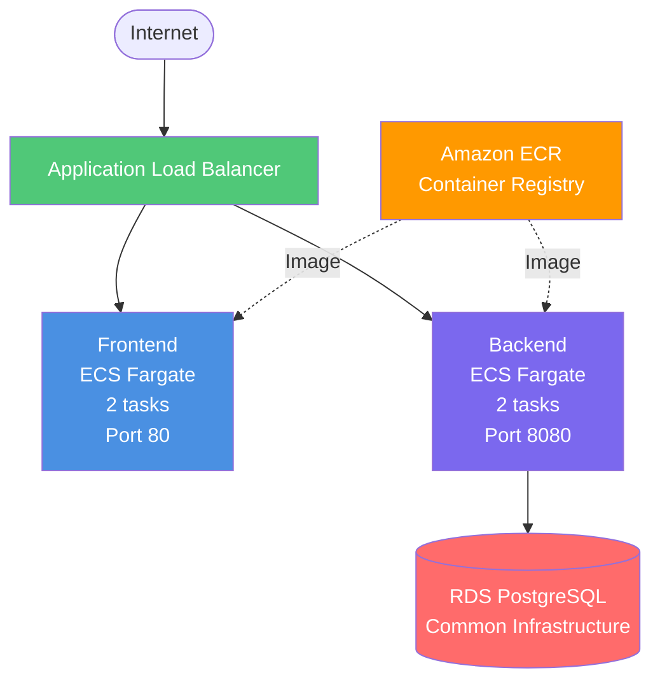

# ECS (Elastic Container Service) Deployment

Deploy your application using AWS ECS Fargate - serverless container orchestration.

## Overview

ECS with Fargate provides container orchestration without managing EC2 instances. Both frontend and backend run as containerized services with automatic scaling and high availability.

## Architecture



**Key Components**:

## Deployment Options

### Manual Deployment
Follow [manual-steps.md](manual-steps.md) for AWS CLI-based deployment.

**Time**: ~30-45 minutes  
**Skill Level**: Intermediate

### Terraform Deployment
Follow [terraform/README.md](terraform/README.md) for infrastructure-as-code deployment.

**Time**: ~15-20 minutes  
**Skill Level**: Intermediate  
**Repeatability**: High (version controlled)

## When to Choose ECS

✅ **Choose ECS if**:
- You want container orchestration without managing servers
- Need auto-scaling and high availability
- Have containerized applications
- Want zero-downtime deployments
- Team is comfortable with containers

❌ **Don't choose ECS if**:
- Very cost-sensitive (use EC2 instead)
- Need direct server access
- Application not containerized
- Very simple application (use App Runner instead)

## Cost Estimate

**Monthly Cost**: ~$81/month total
- ECS Fargate: ~$48/month (4 tasks)
- Application Load Balancer: ~$16/month
- Common Infrastructure (RDS, ECR): ~$15.50/month
- Logs & Data Transfer: ~$1.50/month

## Key Features

- ✅ No server management (Fargate)
- ✅ Auto-scaling based on metrics
- ✅ Rolling deployments (zero-downtime)
- ✅ Container health checks
- ✅ CloudWatch Logs integration
- ✅ Multi-AZ high availability

## Quick Start

1. **Deploy common infrastructure**:
   ```powershell
   cd ..\common\terraform
   terraform apply
   ```

2. **Build and push Docker images** to ECR

3. **Choose deployment method**:
   - **Manual**: See [manual-steps.md](manual-steps.md)
   - **Terraform**: See [terraform/README.md](terraform/README.md)

4. **Test your application**

## Comparison with Other Options

| Feature | ECS | EC2 | Elastic Beanstalk | App Runner |
|---------|-----|-----|-------------------|------------|
| Management | Low | High | Medium | None |
| Cost | $81 | $47 | $49 | $16-$119 |
| Scaling | Auto | Manual | Auto | Auto |
| Deployment | 8-12 min | 5-10 min | 15-20 min | 2-4 min |
| Best For | Containers | Control | Traditional | Simplicity |

## Next Steps

- [Manual Deployment Guide](manual-steps.md)
- [Terraform Deployment Guide](terraform/README.md)
- [Back to Infrastructure Overview](../README.md)
