# ECS (Elastic Container Service) Deployment Guide

## Overview

This option deploys the application using AWS ECS Fargate:
- **Backend**: ECS Fargate service
- **Frontend**: ECS Fargate service
- **Database**: RDS PostgreSQL
- **Load Balancer**: Application Load Balancer (ALB)
- **Container Registry**: Amazon ECR

## Architecture

### High-Level Overview

```mermaid
graph TB
    Internet[🌐 Internet]
    ALB[⚖️ Application Load Balancer<br/>Port 80/443]
    
    subgraph ECS["☁️ ECS Cluster: aws-demo"]
        BackendSvc[📦 ECS Service<br/>Backend<br/>Desired: 2 Fargate Tasks]
        FrontendSvc[📦 ECS Service<br/>Frontend<br/>Desired: 2 Fargate Tasks]
    end
    
    RDS[(🗄️ RDS PostgreSQL<br/>Port 5432)]
    
    Internet --> ALB
    ALB -->|/api/*<br/>Target: IP:8080| BackendSvc
    ALB -->|/*<br/>Target: IP:80| FrontendSvc
    BackendSvc --> RDS
    
    style Internet fill:#e1f5ff
    style ALB fill:#fff4e1
    style ECS fill:#e8f5e9
    style BackendSvc fill:#c8e6c9
    style FrontendSvc fill:#c8e6c9
    style RDS fill:#f3e5f5
```



### Detailed Architecture with ECS Fargate and VPC

```mermaid
graph TB
    subgraph Internet
        Users[👥 Users]
    end
    
    IGW[🌐 Internet Gateway]
    
    subgraph VPC["🏢 VPC (10.0.0.0/16)"]
        ALB[⚖️ ALB<br/>Security Group: ALB-SG<br/>Target Type: IP]
        
        subgraph ECS_Cluster["☁️ ECS Cluster: aws-demo"]
            subgraph BackendService["📦 Backend Service<br/>Launch Type: Fargate<br/>Desired: 2"]
            end
            
            subgraph FrontendService["📦 Frontend Service<br/>Launch Type: Fargate<br/>Desired: 2"]
            end
        end
        
        subgraph AZ1["🏗️ eu-west-1a"]
            subgraph PubSub1["Public Subnet<br/>10.0.1.0/24"]
                BTask1[🐳 Fargate Task<br/>Backend:8080<br/>0.25vCPU, 0.5GB<br/>ENI: Private IP]
                FTask1[🐳 Fargate Task<br/>Frontend:80<br/>0.25vCPU, 0.5GB<br/>ENI: Private IP]
            end
            
            subgraph PrivSub1["🔒 Private Subnet<br/>10.0.10.0/24"]
                RDS1[(🗄️ RDS PostgreSQL<br/>db.t3.micro<br/>SG: RDS-SG)]
            end
        end
        
        subgraph AZ2["🏗️ eu-west-1b"]
            subgraph PubSub2["Public Subnet<br/>10.0.2.0/24"]
                BTask2[🐳 Fargate Task<br/>Backend:8080<br/>0.25vCPU, 0.5GB<br/>ENI: Private IP]
                FTask2[🐳 Fargate Task<br/>Frontend:80<br/>0.25vCPU, 0.5GB<br/>ENI: Private IP]
            end
            
            subgraph PrivSub2["🔒 Private Subnet<br/>10.0.11.0/24"]
                RDS2[(Standby)]
            end
        end
    end
    
    subgraph External["☁️ AWS Managed Services"]
        ECR[📦 Amazon ECR<br/>• backend:latest<br/>• frontend:latest]
        ECSControl[🎛️ ECS Control Plane<br/>• Health monitoring<br/>• Auto-restart failed tasks<br/>• Task scheduling]
    end
    
    Users --> IGW
    IGW --> ALB
    ALB -->|Backend TG| BTask1
    ALB -->|Backend TG| BTask2
    ALB -->|Frontend TG| FTask1
    ALB -->|Frontend TG| FTask2
    
    BackendService -.->|Contains| BTask1
    BackendService -.->|Contains| BTask2
    FrontendService -.->|Contains| FTask1
    FrontendService -.->|Contains| FTask2
    
    BTask1 --> RDS1
    BTask2 --> RDS1
    RDS1 -.->|Multi-AZ| RDS2
    
    BTask1 -.->|Pull Image| ECR
    BTask2 -.->|Pull Image| ECR
    FTask1 -.->|Pull Image| ECR
    FTask2 -.->|Pull Image| ECR
    
    ECSControl -.->|Manages| BackendService
    ECSControl -.->|Manages| FrontendService
    
    style VPC fill:#e3f2fd
    style ECS_Cluster fill:#f1f8e9
    style AZ1 fill:#fff3e0
    style AZ2 fill:#fff3e0
    style PubSub1 fill:#c8e6c9
    style PubSub2 fill:#c8e6c9
    style PrivSub1 fill:#ffcdd2
    style PrivSub2 fill:#ffcdd2
    style External fill:#f3e5f5
```



### ECS Task Lifecycle


### Traffic Flow


**Key ECS Fargate Concepts:**

• **Serverless Containers**: No EC2 instances to manage
• **Task Definition**: Blueprint specifying image, CPU, memory, environment variables
• **Service**: Maintains desired task count, integrates with ALB
• **ENI**: Each task gets its own private IP in VPC
• **Target Type IP**: ALB routes directly to task IPs (not EC2 instance IPs)
• **Auto-Scaling**: Based on CPU, memory, or custom CloudWatch metrics

**Security Group Rules:**

• **ALB-SG**: Allows HTTP (80) and HTTPS (443) from internet (0.0.0.0/0)
• **APP-SG**: Allows 8080 from ALB-SG, 80 from ALB-SG
• **RDS-SG**: Allows 5432 from APP-SG only

## Cost Estimate (us-east-1)

| Resource | Configuration | Monthly Cost |
|----------|---------------|--------------|
| ECS Fargate Backend | 0.25 vCPU, 0.5GB x 2 tasks | ~$15 |
| ECS Fargate Frontend | 0.25 vCPU, 0.5GB x 2 tasks | ~$15 |
| RDS PostgreSQL | db.t3.micro | ~$13 |
| ALB | - | ~$16 |
| NAT Gateway (optional) | - | ~$32 |
| **Total** | | **~$60-90/month** |

## Advantages of ECS

✅ No server management (Fargate)
✅ Auto-scaling built-in
✅ Integrated with CloudWatch for logging
✅ Service discovery
✅ Rolling deployments

## Disadvantages

❌ More complex than Elastic Beanstalk
❌ Requires understanding of task definitions
❌ NAT Gateway costs for private subnets

---

# Manual Deployment Steps

## Prerequisites

1. Common infrastructure deployed (VPC, RDS, ECR)
2. Docker images pushed to ECR
3. AWS CLI configured

## Step 1: Push Docker Images to ECR

> ⚠️ **IMPORTANT**: Before building the frontend image, ensure `frontend/nginx.conf` does NOT have a proxy block for `/api`.
> With ECS + ALB, the load balancer handles API routing. Remove or comment out any `location /api { proxy_pass ... }` block.

```bash
# Get AWS account ID
export AWS_ACCOUNT_ID=$(aws sts get-caller-identity --query Account --output text)
export AWS_REGION=us-east-1

# Login to ECR
aws ecr get-login-password --region $AWS_REGION | docker login --username AWS --password-stdin $AWS_ACCOUNT_ID.dkr.ecr.$AWS_REGION.amazonaws.com

# Build and push backend
cd backend
docker build -t aws-demo-backend .
docker tag aws-demo-backend:latest $AWS_ACCOUNT_ID.dkr.ecr.$AWS_REGION.amazonaws.com/aws-demo-backend:latest
docker push $AWS_ACCOUNT_ID.dkr.ecr.$AWS_REGION.amazonaws.com/aws-demo-backend:latest

# Build and push frontend
cd ../frontend
docker build -t aws-demo-frontend .
docker tag aws-demo-frontend:latest $AWS_ACCOUNT_ID.dkr.ecr.$AWS_REGION.amazonaws.com/aws-demo-frontend:latest
docker push $AWS_ACCOUNT_ID.dkr.ecr.$AWS_REGION.amazonaws.com/aws-demo-frontend:latest
```

## Step 2: Create ECS Cluster

```bash
# Create ECS cluster
aws ecs create-cluster --cluster-name aws-demo-cluster --capacity-providers FARGATE FARGATE_SPOT

# Verify cluster creation
aws ecs describe-clusters --clusters aws-demo-cluster
```

## Step 3: Create IAM Roles

```bash
# Create ECS Task Execution Role
cat > ecs-task-execution-trust.json << 'EOF'
{
  "Version": "2012-10-17",
  "Statement": [
    {
      "Effect": "Allow",
      "Principal": {
        "Service": "ecs-tasks.amazonaws.com"
      },
      "Action": "sts:AssumeRole"
    }
  ]
}
EOF

aws iam create-role \
  --role-name aws-demo-ecs-task-execution-role \
  --assume-role-policy-document file://ecs-task-execution-trust.json

aws iam attach-role-policy \
  --role-name aws-demo-ecs-task-execution-role \
  --policy-arn arn:aws:iam::aws:policy/service-role/AmazonECSTaskExecutionRolePolicy

# Get role ARN
export EXECUTION_ROLE_ARN=$(aws iam get-role --role-name aws-demo-ecs-task-execution-role --query 'Role.Arn' --output text)
```

## Step 4: Create CloudWatch Log Groups

```bash
aws logs create-log-group --log-group-name /ecs/aws-demo-backend
aws logs create-log-group --log-group-name /ecs/aws-demo-frontend
```

## Step 5: Create Task Definitions

### Backend Task Definition

```bash
cat > backend-task-definition.json << EOF
{
  "family": "aws-demo-backend",
  "networkMode": "awsvpc",
  "requiresCompatibilities": ["FARGATE"],
  "cpu": "256",
  "memory": "512",
  "executionRoleArn": "$EXECUTION_ROLE_ARN",
  "containerDefinitions": [
    {
      "name": "backend",
      "image": "$AWS_ACCOUNT_ID.dkr.ecr.$AWS_REGION.amazonaws.com/aws-demo-backend:latest",
      "essential": true,
      "portMappings": [
        {
          "containerPort": 8080,
          "protocol": "tcp"
        }
      ],
      "environment": [
        {"name": "DATABASE_URL", "value": "jdbc:postgresql://YOUR_RDS_ENDPOINT:5432/awsdemo"},
        {"name": "DATABASE_USER", "value": "postgres"},
        {"name": "DATABASE_PASSWORD", "value": "YourSecurePassword123"}
      ],
      "logConfiguration": {
        "logDriver": "awslogs",
        "options": {
          "awslogs-group": "/ecs/aws-demo-backend",
          "awslogs-region": "$AWS_REGION",
          "awslogs-stream-prefix": "ecs"
        }
      }
    }
  ]
}
EOF

aws ecs register-task-definition --cli-input-json file://backend-task-definition.json
```

### Frontend Task Definition

```bash
cat > frontend-task-definition.json << EOF
{
  "family": "aws-demo-frontend",
  "networkMode": "awsvpc",
  "requiresCompatibilities": ["FARGATE"],
  "cpu": "256",
  "memory": "512",
  "executionRoleArn": "$EXECUTION_ROLE_ARN",
  "containerDefinitions": [
    {
      "name": "frontend",
      "image": "$AWS_ACCOUNT_ID.dkr.ecr.$AWS_REGION.amazonaws.com/aws-demo-frontend:latest",
      "essential": true,
      "portMappings": [
        {
          "containerPort": 80,
          "protocol": "tcp"
        }
      ],
      "logConfiguration": {
        "logDriver": "awslogs",
        "options": {
          "awslogs-group": "/ecs/aws-demo-frontend",
          "awslogs-region": "$AWS_REGION",
          "awslogs-stream-prefix": "ecs"
        }
      }
    }
  ]
}
EOF

aws ecs register-task-definition --cli-input-json file://frontend-task-definition.json
```

## Step 6: Create Application Load Balancer

> ⚠️ **Windows Git Bash Users**: Git Bash converts paths starting with `/` to Windows paths.
> Use `//api/messages` (double slash) or run in **PowerShell** or **CMD** instead.

```bash
# Create ALB (use values from common infrastructure)
aws elbv2 create-load-balancer \
  --name aws-demo-ecs-alb \
  --subnets subnet-xxxxx subnet-yyyyy \
  --security-groups sg-xxxxx \
  --scheme internet-facing \
  --type application

export ALB_ARN=$(aws elbv2 describe-load-balancers --names aws-demo-ecs-alb --query 'LoadBalancers[0].LoadBalancerArn' --output text)

# Create Backend Target Group
# NOTE: Use //api/messages in Git Bash, or /api/messages in PowerShell/CMD
aws elbv2 create-target-group \
  --name aws-demo-ecs-backend-tg \
  --protocol HTTP \
  --port 8080 \
  --vpc-id vpc-xxxxx \
  --target-type ip \
  --health-check-path //api/messages

export BACKEND_TG_ARN=$(aws elbv2 describe-target-groups --names aws-demo-ecs-backend-tg --query 'TargetGroups[0].TargetGroupArn' --output text)

# Create Frontend Target Group
aws elbv2 create-target-group \
  --name aws-demo-ecs-frontend-tg \
  --protocol HTTP \
  --port 80 \
  --vpc-id vpc-xxxxx \
  --target-type ip \
  --health-check-path //

export FRONTEND_TG_ARN=$(aws elbv2 describe-target-groups --names aws-demo-ecs-frontend-tg --query 'TargetGroups[0].TargetGroupArn' --output text)

# Create Listener
aws elbv2 create-listener \
  --load-balancer-arn $ALB_ARN \
  --protocol HTTP \
  --port 80 \
  --default-actions Type=forward,TargetGroupArn=$FRONTEND_TG_ARN

export LISTENER_ARN=$(aws elbv2 describe-listeners --load-balancer-arn $ALB_ARN --query 'Listeners[0].ListenerArn' --output text)

# Add rule for /api/*
aws elbv2 create-rule \
  --listener-arn $LISTENER_ARN \
  --priority 10 \
  --conditions Field=path-pattern,Values='/api/*' \
  --actions Type=forward,TargetGroupArn=$BACKEND_TG_ARN
```

## Step 7: Create ECS Services

### Backend Service

```bash
aws ecs create-service \
  --cluster aws-demo-cluster \
  --service-name aws-demo-backend-service \
  --task-definition aws-demo-backend \
  --desired-count 2 \
  --launch-type FARGATE \
  --network-configuration "awsvpcConfiguration={subnets=[subnet-xxxxx,subnet-yyyyy],securityGroups=[sg-xxxxx],assignPublicIp=ENABLED}" \
  --load-balancers "targetGroupArn=$BACKEND_TG_ARN,containerName=backend,containerPort=8080"
```

### Frontend Service

```bash
aws ecs create-service \
  --cluster aws-demo-cluster \
  --service-name aws-demo-frontend-service \
  --task-definition aws-demo-frontend \
  --desired-count 2 \
  --launch-type FARGATE \
  --network-configuration "awsvpcConfiguration={subnets=[subnet-xxxxx,subnet-yyyyy],securityGroups=[sg-xxxxx],assignPublicIp=ENABLED}" \
  --load-balancers "targetGroupArn=$FRONTEND_TG_ARN,containerName=frontend,containerPort=80"
```

## Step 8: Configure Auto Scaling (Optional)

```bash
# Register scalable target
aws application-autoscaling register-scalable-target \
  --service-namespace ecs \
  --resource-id service/aws-demo-cluster/aws-demo-backend-service \
  --scalable-dimension ecs:service:DesiredCount \
  --min-capacity 2 \
  --max-capacity 10

# Create scaling policy
aws application-autoscaling put-scaling-policy \
  --service-namespace ecs \
  --resource-id service/aws-demo-cluster/aws-demo-backend-service \
  --scalable-dimension ecs:service:DesiredCount \
  --policy-name cpu-scaling \
  --policy-type TargetTrackingScaling \
  --target-tracking-scaling-policy-configuration '{
    "TargetValue": 70.0,
    "PredefinedMetricSpecification": {
      "PredefinedMetricType": "ECSServiceAverageCPUUtilization"
    },
    "ScaleInCooldown": 300,
    "ScaleOutCooldown": 60
  }'
```

## Step 9: Test the Deployment

```bash
# Get ALB DNS name
aws elbv2 describe-load-balancers --names aws-demo-ecs-alb --query 'LoadBalancers[0].DNSName' --output text

# Test
curl http://<ALB_DNS_NAME>/
curl http://<ALB_DNS_NAME>/api/messages
```

## Updating Services

```bash
# Update backend service with new image
aws ecs update-service \
  --cluster aws-demo-cluster \
  --service aws-demo-backend-service \
  --force-new-deployment
```

---

# Cleanup

```bash
# Delete ECS services
aws ecs update-service --cluster aws-demo-cluster --service aws-demo-backend-service --desired-count 0
aws ecs update-service --cluster aws-demo-cluster --service aws-demo-frontend-service --desired-count 0
aws ecs delete-service --cluster aws-demo-cluster --service aws-demo-backend-service
aws ecs delete-service --cluster aws-demo-cluster --service aws-demo-frontend-service

# Delete cluster
aws ecs delete-cluster --cluster aws-demo-cluster

# Delete ALB
aws elbv2 delete-load-balancer --load-balancer-arn $ALB_ARN

# Delete target groups
aws elbv2 delete-target-group --target-group-arn $BACKEND_TG_ARN
aws elbv2 delete-target-group --target-group-arn $FRONTEND_TG_ARN

# Delete log groups
aws logs delete-log-group --log-group-name /ecs/aws-demo-backend
aws logs delete-log-group --log-group-name /ecs/aws-demo-frontend
```
