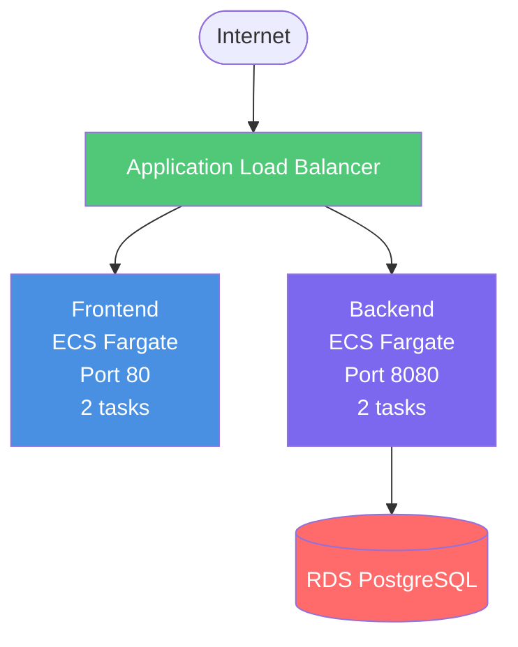

# ECS (Elastic Container Service) Deployment with Terraform

This Terraform configuration deploys the application using AWS ECS Fargate with both frontend and backend as containerized services.

## Architecture



## Key Features

- **Serverless Containers**: Fargate eliminates EC2 instance management
- **Auto-Scaling**: Tasks scale based on CPU/memory usage
- **High Availability**: Tasks distributed across multiple AZs
- **Rolling Deployments**: Zero-downtime deployments
- **Container Health Checks**: Automatic task replacement if unhealthy
- **Integrated Logging**: CloudWatch Logs for all tasks

## Resources Created

- **ECS Cluster**: Container orchestration cluster
- **2 ECS Services**: One for frontend, one for backend (2 tasks each)
- **2 Task Definitions**: Container specifications
- **Application Load Balancer**: Routes traffic to ECS services
- **2 Target Groups**: One for each service (IP target type)
- **CloudWatch Log Groups**: Container logs
- **IAM Roles**: Task execution and task roles
- **Security Groups**: Inherited from common infrastructure

## Prerequisites

### 1. Deploy Common Infrastructure

```powershell
cd C:\Users\AyodeleOladeji\Documents\dev\aws-deployment\infrastructure\common\terraform
terraform init
terraform apply
```

Expected outputs: VPC, subnets, RDS, ECR repositories, security groups

### 2. Build and Push Docker Images to ECR

```powershell
# Get ECR URLs
cd C:\Users\AyodeleOladeji\Documents\dev\aws-deployment\infrastructure\common\terraform
$ECR_BACKEND = terraform output -raw ecr_backend_url
$ECR_FRONTEND = terraform output -raw ecr_frontend_url
$AWS_REGION = "eu-west-1"
$ACCOUNT_ID = (terraform output -raw ecr_backend_url).Split('.')[0]

# Authenticate Docker to ECR
aws ecr get-login-password --region $AWS_REGION | docker login --username AWS --password-stdin "$ACCOUNT_ID.dkr.ecr.$AWS_REGION.amazonaws.com"

# Build and push backend
cd C:\Users\AyodeleOladeji\Documents\dev\aws-deployment\backend
docker build -t aws-demo-backend .
docker tag aws-demo-backend:latest "$ECR_BACKEND:latest"
docker push "$ECR_BACKEND:latest"

# Build and push frontend
cd C:\Users\AyodeleOladeji\Documents\dev\aws-deployment\frontend
docker build -t aws-demo-frontend .
docker tag aws-demo-frontend:latest "$ECR_FRONTEND:latest"
docker push "$ECR_FRONTEND:latest"
```

⚠️ **Important**: Images must exist in ECR before deploying ECS services.

## Configuration

Create or edit `terraform.tfvars`:

```hcl
aws_region   = "eu-west-1"
project_name = "aws-demo"

# ECS Configuration
backend_cpu      = 256    # 0.25 vCPU
backend_memory   = 512    # 512 MB
frontend_cpu     = 256    # 0.25 vCPU
frontend_memory  = 512    # 512 MB

backend_desired_count  = 2
frontend_desired_count = 2

# Database Configuration (must match common infrastructure)
db_username = "postgres"
db_password = "TestPassword123!"  # Change in production!
```

### Resource Sizing Guide

| Size | CPU | Memory | Use Case | Monthly Cost |
|------|-----|--------|----------|--------------|
| Small | 256 (.25 vCPU) | 512 MB | Dev/Test | ~$12/task |
| Medium | 512 (.5 vCPU) | 1024 MB | Low traffic | ~$24/task |
| Large | 1024 (1 vCPU) | 2048 MB | Production | ~$48/task |

**Note**: Costs shown are per task. Total = (Backend tasks + Frontend tasks) × Cost per task

## Deployment Steps

### Step 1: Navigate to ECS Terraform Directory

```powershell
cd C:\Users\AyodeleOladeji\Documents\dev\aws-deployment\infrastructure\2-ecs\terraform
```

### Step 2: Create terraform.tfvars

```powershell
notepad terraform.tfvars
```

Copy the configuration above and adjust as needed.

### Step 3: Initialize Terraform

```powershell
terraform init
```

**Expected**: "Terraform has been successfully initialized!"

### Step 4: Validate Configuration

```powershell
terraform validate
```

**Expected**: "Success! The configuration is valid."

### Step 5: Preview Changes

```powershell
terraform plan
```

**Expected**: Plan to create ~15-20 resources including:
- ECS cluster
- 2 ECS services
- 2 Task definitions
- ALB and target groups
- IAM roles
- CloudWatch log groups

### Step 6: Deploy ECS Infrastructure

```powershell
terraform apply
```

- Type `yes` when prompted
- **Duration**: ~8-12 minutes

**Expected output**:
```
Apply complete! Resources: 18 added, 0 changed, 0 destroyed.

Outputs:
alb_dns_name = "aws-demo-alb-xxxxx.eu-west-1.elb.amazonaws.com"
ecs_cluster_name = "aws-demo-cluster"
backend_service_name = "aws-demo-backend"
frontend_service_name = "aws-demo-frontend"
application_url = "http://aws-demo-alb-xxxxx.eu-west-1.elb.amazonaws.com"
```

### Step 7: Wait for Services to Stabilize

```powershell
# Check service status
aws ecs describe-services --cluster aws-demo-cluster --services aws-demo-backend aws-demo-frontend --region eu-west-1
```

Wait until `runningCount` equals `desiredCount` for both services (~3-5 minutes).

### Step 8: Get Application URL

```powershell
terraform output application_url
```

## Testing

### Test Frontend

```powershell
$APP_URL = terraform output -raw application_url
Start-Process $APP_URL
```

### Test Backend API

```powershell
$ALB_DNS = terraform output -raw alb_dns_name
curl "http://$ALB_DNS/api/messages"
```

### Check ECS Services

```powershell
$CLUSTER = terraform output -raw ecs_cluster_name
aws ecs list-services --cluster $CLUSTER --region eu-west-1
aws ecs describe-services --cluster $CLUSTER --services aws-demo-backend aws-demo-frontend --region eu-west-1
```

### View Container Logs

```powershell
# Get task ARN
$CLUSTER = terraform output -raw ecs_cluster_name
aws ecs list-tasks --cluster $CLUSTER --service-name aws-demo-backend --region eu-west-1

# View logs (requires task ID)
aws logs tail /ecs/aws-demo-backend --follow --region eu-west-1
aws logs tail /ecs/aws-demo-frontend --follow --region eu-west-1
```

## Updating Application

### Update Backend

```powershell
# 1. Build and push new image
cd C:\Users\AyodeleOladeji\Documents\dev\aws-deployment\backend
docker build -t aws-demo-backend .

# 2. Get ECR URL
cd C:\Users\AyodeleOladeji\Documents\dev\aws-deployment\infrastructure\common\terraform
$ECR_BACKEND = terraform output -raw ecr_backend_url

# 3. Tag and push
docker tag aws-demo-backend:latest "$ECR_BACKEND:latest"
docker push "$ECR_BACKEND:latest"

# 4. Force new deployment (ECS will pull latest image)
cd C:\Users\AyodeleOladeji\Documents\dev\aws-deployment\infrastructure\2-ecs\terraform
$CLUSTER = terraform output -raw ecs_cluster_name
aws ecs update-service --cluster $CLUSTER --service aws-demo-backend --force-new-deployment --region eu-west-1
```

**Duration**: ~3-5 minutes (rolling deployment)

### Update Frontend

```powershell
# 1. Build and push new image
cd C:\Users\AyodeleOladeji\Documents\dev\aws-deployment\frontend
docker build -t aws-demo-frontend .

# 2. Get ECR URL
cd C:\Users\AyodeleOladeji\Documents\dev\aws-deployment\infrastructure\common\terraform
$ECR_FRONTEND = terraform output -raw ecr_frontend_url

# 3. Tag and push
docker tag aws-demo-frontend:latest "$ECR_FRONTEND:latest"
docker push "$ECR_FRONTEND:latest"

# 4. Force new deployment
cd C:\Users\AyodeleOladeji\Documents\dev\aws-deployment\infrastructure\2-ecs\terraform
$CLUSTER = terraform output -raw ecs_cluster_name
aws ecs update-service --cluster $CLUSTER --service aws-demo-frontend --force-new-deployment --region eu-west-1
```

## Scaling

### Manual Scaling

```powershell
# Scale backend to 4 tasks
$CLUSTER = terraform output -raw ecs_cluster_name
aws ecs update-service --cluster $CLUSTER --service aws-demo-backend --desired-count 4 --region eu-west-1

# Scale frontend to 3 tasks
aws ecs update-service --cluster $CLUSTER --service aws-demo-frontend --desired-count 3 --region eu-west-1
```

### Update terraform.tfvars for Permanent Scaling

```hcl
backend_desired_count  = 4
frontend_desired_count = 3
```

Then run:
```powershell
terraform apply
```

## Troubleshooting

### Tasks Not Starting

```powershell
# Check service events
$CLUSTER = terraform output -raw ecs_cluster_name
aws ecs describe-services --cluster $CLUSTER --services aws-demo-backend --region eu-west-1 --query 'services[0].events[0:5]'
```

Common issues:
- Image not found in ECR → Push images first
- Insufficient CPU/memory → Check task definition
- Security group issues → Verify ALB can reach tasks

### Check Task Status

```powershell
# List all tasks
$CLUSTER = terraform output -raw ecs_cluster_name
aws ecs list-tasks --cluster $CLUSTER --region eu-west-1

# Describe specific task
aws ecs describe-tasks --cluster $CLUSTER --tasks <task-arn> --region eu-west-1
```

### View Container Logs

```powershell
# Backend logs
aws logs tail /ecs/aws-demo-backend --follow --region eu-west-1

# Frontend logs
aws logs tail /ecs/aws-demo-frontend --follow --region eu-west-1

# Last 100 lines
aws logs tail /ecs/aws-demo-backend --since 30m --region eu-west-1
```

### Target Health Checks Failing

```powershell
# Get target group ARN from AWS console or terraform output
aws elbv2 describe-target-health --target-group-arn <arn> --region eu-west-1
```

Check:
- Container is listening on correct port
- Health check path is correct
- Security groups allow ALB → ECS traffic

### Service Won't Update

```powershell
# Check deployment status
$CLUSTER = terraform output -raw ecs_cluster_name
aws ecs describe-services --cluster $CLUSTER --services aws-demo-backend --region eu-west-1 --query 'services[0].deployments'
```

If stuck:
```powershell
# Stop old tasks manually
aws ecs list-tasks --cluster $CLUSTER --service-name aws-demo-backend --region eu-west-1
aws ecs stop-task --cluster $CLUSTER --task <task-id> --region eu-west-1
```

## Cost Estimate

Monthly costs (eu-west-1) with default configuration:

| Service | Configuration | Estimated Cost |
|---------|--------------|----------------|
| ECS Fargate (Backend) | 2 tasks × 256 CPU, 512 MB | ~$24.00 |
| ECS Fargate (Frontend) | 2 tasks × 256 CPU, 512 MB | ~$24.00 |
| Application Load Balancer | 1 ALB, minimal traffic | $16.00 |
| Data Transfer | Minimal | $1.00 |
| CloudWatch Logs | ~1GB/month | $0.50 |
| **Total (ECS layer)** | | **~$65.50/month** |
| **Common Infrastructure** | RDS, ECR, VPC | **$15.50/month** |
| **Grand Total** | | **~$81/month** |

### Cost Optimization Tips

1. **Reduce Task Count**: Use 1 task per service for dev: ~$41/month savings
2. **Smaller Tasks**: Use 256 CPU/512 MB for low traffic
3. **Spot Fargate**: Use Fargate Spot for 70% discount (production should use regular)
4. **Reserved Capacity**: For predictable workloads

## Advantages of ECS

✅ **No Server Management**: Fargate handles infrastructure
✅ **Auto-Scaling**: Scale based on metrics
✅ **Rolling Deployments**: Zero-downtime updates
✅ **Container Native**: Built for Docker
✅ **Integrated Logging**: CloudWatch Logs automatic
✅ **Service Discovery**: Built-in service mesh (optional)
✅ **High Availability**: Multi-AZ by default

## Disadvantages

❌ **Higher Cost**: More expensive than EC2
❌ **Cold Start**: New tasks take 30-60s to start
❌ **Less Control**: Limited OS-level access
❌ **Complexity**: More AWS services to manage

## When to Use ECS

✅ **Use ECS when**:
- You want container orchestration without managing servers
- Need auto-scaling and high availability
- Have containerized applications
- Want zero-downtime deployments
- Team is comfortable with containers

❌ **Don't use ECS when**:
- Very cost-sensitive (use EC2 instead)
- Need direct server access
- Application not containerized
- Very simple application (use App Runner instead)

## Cleanup

```powershell
# Stop all tasks first (optional, but faster)
$CLUSTER = terraform output -raw ecs_cluster_name
aws ecs update-service --cluster $CLUSTER --service aws-demo-backend --desired-count 0 --region eu-west-1
aws ecs update-service --cluster $CLUSTER --service aws-demo-frontend --desired-count 0 --region eu-west-1

# Wait 2 minutes, then destroy
terraform destroy
```

Type `yes` when prompted.

⚠️ This will delete all ECS resources. Common infrastructure (VPC, RDS, ECR) will remain.

## Migration Path

**From EC2 to ECS**:
1. Containerize application (if not already)
2. Push images to ECR
3. Destroy EC2 infrastructure
4. Deploy ECS infrastructure
5. Update DNS/endpoints

**From ECS to other options**:
- Can switch to App Runner for simpler management
- Can switch to EC2 for lower costs
- Can use same Docker images

## Additional Resources

- [AWS ECS Documentation](https://docs.aws.amazon.com/ecs/)
- [Fargate Pricing](https://aws.amazon.com/fargate/pricing/)
- [ECS Best Practices](https://docs.aws.amazon.com/AmazonECS/latest/bestpracticesguide/)
