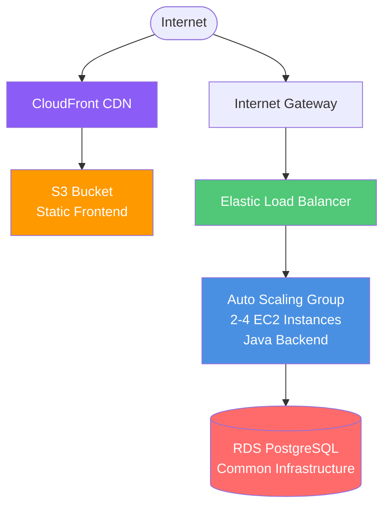

# Elastic Beanstalk Deployment

Deploy your application using AWS Elastic Beanstalk - Platform as a Service (PaaS) with managed infrastructure.

## Overview

Elastic Beanstalk provides a PaaS experience where AWS manages the infrastructure (EC2, Load Balancer, Auto Scaling) while you focus on application code. Backend runs as Java JAR on EC2, frontend is served via S3 + CloudFront.

## Architecture



**Key Components**:

## Deployment Options

### Manual Deployment
Follow [manual-steps.md](manual-steps.md) for AWS CLI and EB CLI-based deployment.

**Time**: ~45-60 minutes  
**Skill Level**: Intermediate

### Terraform Deployment
Follow [terraform/README.md](terraform/README.md) for infrastructure-as-code deployment.

**Time**: ~20-30 minutes  
**Skill Level**: Intermediate  
**Repeatability**: High (version controlled)

## When to Choose Elastic Beanstalk

✅ **Choose Elastic Beanstalk if**:
- You want PaaS simplicity
- Running Java/Python/Node.js applications
- Need auto-scaling without complexity
- Want AWS-managed infrastructure
- Team is not container-expert
- Need easy environment management (dev/staging/prod)

❌ **Don't choose Elastic Beanstalk if**:
- Need fine-grained control (use EC2)
- Using complex microservices (use ECS/EKS)
- Multi-cloud deployment needed
- Want cutting-edge features (use App Runner)

## Cost Estimate

**Monthly Cost**: ~$49/month total
- EC2 Instances (2 × t3.micro): ~$15/month
- Elastic Load Balancer: ~$16/month
- S3 + CloudFront: ~$1.50/month
- Common Infrastructure (RDS): ~$15.50/month
- Data Transfer: ~$1/month

**Sweet Spot**: Best cost-to-features ratio for traditional applications

## Key Features

- ✅ Easy management - AWS handles infrastructure
- ✅ Platform updates - Automatic OS and runtime updates
- ✅ Monitoring built-in - CloudWatch dashboards included
- ✅ Quick rollback - Easy version management
- ✅ Multiple environments - Dev/staging/prod setup
- ✅ Lower cost - Cheaper than ECS/Fargate
- ✅ Java native - Optimized for Java applications

## Quick Start

1. **Deploy common infrastructure**:
   ```powershell
   cd ..\common\terraform
   terraform apply
   ```

2. **Build backend JAR**:
   ```powershell
   cd ..\..\backend
   mvn clean package
   ```

3. **Build frontend**:
   ```powershell
   cd ..\frontend
   npm run build
   ```

4. **Choose deployment method**:
   - **Manual**: See [manual-steps.md](manual-steps.md)
   - **Terraform**: See [terraform/README.md](terraform/README.md)

5. **Test your application**

## Comparison with Other Options

| Feature | Elastic Beanstalk | EC2 | ECS | App Runner |
|---------|------------------|-----|-----|------------|
| Management | Low | High | Low | None |
| Cost | $49 | $47 | $81 | $16-$119 |
| Scaling | Auto | Manual | Auto | Auto |
| Deployment | 15-20 min | 5-10 min | 8-12 min | 2-4 min |
| Platform Updates | Auto | Manual | Manual | Auto |
| Best For | Traditional Apps | Control | Containers | Simplicity |

## Environment Management

Elastic Beanstalk makes it easy to manage multiple environments:

```powershell
# Clone production environment for staging
eb clone production-env --name staging-env

# Swap environments (blue-green deployment)
eb swap production-env staging-env
```

## Next Steps

- [Manual Deployment Guide](manual-steps.md)
- [Terraform Deployment Guide](terraform/README.md)
- [EB Extensions Configuration](.ebextensions/)
- [Back to Infrastructure Overview](../README.md)
