# Elastic Beanstalk Deployment Guide

## Overview

This option deploys the application using AWS Elastic Beanstalk:
- **Backend**: Elastic Beanstalk Java environment (JAR deployment)
- **Frontend**: S3 + CloudFront (static hosting) OR Elastic Beanstalk Docker
- **Database**: RDS PostgreSQL (managed by EB or standalone)

## Architecture

### High-Level Overview

```mermaid
graph TB
    Internet[🌐 Internet]
    
    subgraph Frontend["🎨 Frontend Path"]
        CF[☁️ CloudFront CDN<br/>Global Edge Locations]
        S3[🪣 S3 Bucket<br/>Static Files<br/>• index.html<br/>• assets/*.js<br/>• assets/*.css]
    end
    
    subgraph Backend["⚙️ Backend Path"]
        IGW[🌐 Internet Gateway]
        
        subgraph EB["📦 Elastic Beanstalk Environment"]
            ELB[⚖️ Load Balancer<br/>Managed by EB]
            ASG[📈 Auto Scaling Group<br/>Min: 1, Max: 4, Desired: 2]
            EC2_1[🖥️ EC2 Instance 1<br/>Java 17 + Tomcat<br/>t3.micro]
            EC2_2[🖥️ EC2 Instance 2<br/>Java 17 + Tomcat<br/>t3.micro]
        end
    end
    
    RDS[(🗄️ RDS PostgreSQL<br/>db.t3.micro)]
    
    Internet --> CF
    CF --> S3
    Internet --> IGW
    IGW --> ELB
    ELB --> ASG
    ASG --> EC2_1
    ASG --> EC2_2
    EC2_1 --> RDS
    EC2_2 --> RDS
    
    style Frontend fill:#e1f5ff
    style Backend fill:#fff4e1
    style EB fill:#e8f5e9
    style RDS fill:#f3e5f5
```



### Detailed Architecture with Elastic Beanstalk Components
```
┌─────────────────────────────────────────────────────────────────────────────┐
│                               Internet Users                                 │
└──────────┬─────────────────────────────────────────────┬────────────────────┘
           │                                             │
           │ (Frontend Assets)                           │ (API Requests)
           │                                             │
  ┌────────▼─────────┐                         ┌────────▼──────────┐
  │   CloudFront     │                         │  Internet Gateway │
  │   Distribution   │                         └────────┬──────────┘
  │   (Global CDN)   │                                  │
  └────────┬─────────┘                                  │
           │                         ┌───────────────────────────────────────┐
  ┌────────▼─────────┐               │ VPC (Elastic Beanstalk Managed)       │
  │   S3 Bucket      │               │                                       │
  │ (Static Frontend)│               │  ┌─────────────────────────────────┐  │
  │ • index.html     │               │  │ Elastic Beanstalk Environment   │  │
  │ • assets/*.js    │               │  │ Name: aws-demo-backend-env      │  │
  │ • assets/*.css   │               │  │ Platform: Java 17 / Tomcat      │  │
  │                  │               │  │                                 │  │
  │ Versioning: On   │               │  │  ┌──────────────────────────┐   │  │
  └──────────────────┘               │  │  │ Application Load Balancer│   │  │
                                     │  │  │ (Managed by EB)          │   │  │
                                     │  │  │ Security Group: eb-lb-sg │   │  │
                                     │  │  │ Inbound: 80, 443         │   │  │
                                     │  │  └──────────┬───────────────┘   │  │
                                     │  │             │                   │  │
                                     │  │  ┌──────────▼───────────────┐   │  │
                                     │  │  │  Auto Scaling Group      │   │  │
                                     │  │  │  Min: 1, Max: 4          │   │  │
                                     │  │  │  Desired: 2              │   │  │
                                     │  │  │  Health Check: ELB       │   │  │
                                     │  │  │                          │   │  │
                                     │  │  │  ┌──────────────────┐    │   │  │
                                     │  │  │  │ EC2 Instance 1   │    │   │  │
                                     │  │  │  │ t3.micro         │    │   │  │
                                     │  │  │  │ eu-west-1a       │    │   │  │
                                     │  │  │  │ • Spring Boot JAR│    │   │  │
                                     │  │  │  │ • Runs on port   │    │   │  │
                                     │  │  │  │   5000 (Tomcat)  │    │   │  │
                                     │  │  │  │ • CloudWatch logs│    │   │  │
                                     │  │  │  │ • Enhanced health│    │   │  │
                                     │  │  │  └────────┬─────────┘    │   │  │
                                     │  │  │           │              │   │  │
                                     │  │  │  ┌────────▼─────────┐    │   │  │
                                     │  │  │  │ EC2 Instance 2   │    │   │  │
                                     │  │  │  │ t3.micro         │    │   │  │
                                     │  │  │  │ eu-west-1b       │    │   │  │
                                     │  │  │  │ (Same config)    │    │   │  │
                                     │  │  │  └────────┬─────────┘    │   │  │
                                     │  │  └───────────┼──────────────┘   │  │
                                     │  │              │                  │  │
                                     │  └──────────────┼──────────────────┘  │
                                     │                 │                     │
                                     │    ┌────────────▼──────────────┐      │
                                     │    │ RDS PostgreSQL            │      │
                                     │    │ (Separate or EB-managed)  │      │
                                     │    │ • db.t3.micro             │      │
                                     │    │ • Multi-AZ: Optional      │      │
                                     │    │ • Security Group: rds-sg  │      │
                                     │    │ • Inbound: 5432 from      │      │
                                     │    │   EB instances only       │      │
                                     │    └───────────────────────────┘      │
                                     └─────────────────────────────────────────┘

┌─────────────────────────────────────────────────────────────────────────────┐
│                    Elastic Beanstalk Control Plane                           │
│                                                                              │
│  • Monitors application health (Enhanced Health Reporting)                   │
│  • Auto-scales based on metrics (CPU, Network, Custom CloudWatch)            │
│  • Automatically patches and updates platform                                │
│  • Rotates logs to S3                                                        │
│  • Manages deployments (Rolling, Immutable, Blue/Green)                      │
│  • Integrates with CloudWatch for monitoring and alarms                      │
└─────────────────────────────────────────────────────────────────────────────┘
```

**Key Elastic Beanstalk Concepts:**

• **Application**: Top-level container (can have multiple environments)
• **Environment**: Running deployment (dev, staging, prod)
• **Platform**: Runtime (Java 17 with Tomcat, Docker, Node.js, etc.)
• **Deployment Policies**: Rolling, All-at-once, Immutable, Blue/Green
• **Managed Updates**: EB automatically applies security patches
• **Environment Variables**: Injected into application (DATABASE_URL, etc.)

**Traffic Flow:**

**Frontend:**
1. User requests static files → CloudFront CDN
2. CloudFront → S3 Bucket → Returns HTML/JS/CSS
3. Client-side JavaScript calls API endpoints

**Backend:**
1. API request → EB Load Balancer (port 80/443)
2. Load Balancer → One of the EC2 instances in Auto Scaling Group
3. EC2 Instance (Spring Boot on Tomcat:5000) → Processes request
4. Spring Boot → RDS PostgreSQL:5432 (database query)
5. Response flows back to user

**Scaling Behavior:**
• CPU > 80% for 5 min → Add instance (up to max: 4)
• CPU < 20% for 10 min → Remove instance (down to min: 1)
• Load Balancer distributes traffic across healthy instances only
```

### Detailed Architecture with Elastic Beanstalk

```mermaid
graph TB
    subgraph Internet
        Users[👥 Users]
    end
    
    IGW[🌐 Internet Gateway]
    
    subgraph Frontend_Stack["🎨 Frontend Stack"]
        CF[☁️ CloudFront<br/>CDN Distribution]
        S3[🪣 S3 Bucket<br/>• React Build<br/>• Versioning: On]
    end
    
    subgraph VPC["🏢 VPC (EB Managed)"]
        subgraph EB_Environment["📦 Elastic Beanstalk Environment<br/>Platform: Java 17 with Tomcat"]
            ELB[⚖️ Application Load Balancer<br/>SG: eb-lb-sg<br/>Ports: 80, 443]
            
            subgraph ASG["📈 Auto Scaling Group<br/>Min: 1, Max: 4, Desired: 2"]
                subgraph AZ1["🏗️ eu-west-1a"]
                    EC2_1[🖥️ EC2 Instance 1<br/>t3.micro<br/>• Spring Boot JAR<br/>• Tomcat:5000<br/>• CloudWatch Agent<br/>• Enhanced Health]
                end
                
                subgraph AZ2["🏗️ eu-west-1b"]
                    EC2_2[🖥️ EC2 Instance 2<br/>t3.micro<br/>• Spring Boot JAR<br/>• Tomcat:5000<br/>• CloudWatch Agent<br/>• Enhanced Health]
                end
            end
        end
        
        subgraph Database["🔒 Private Subnets"]
            RDS[(🗄️ RDS PostgreSQL<br/>db.t3.micro<br/>SG: rds-sg<br/>Port: 5432<br/>Multi-AZ: Optional)]
        end
    end
    
    subgraph EB_Control["🎛️ Elastic Beanstalk Control Plane"]
        Monitor[📊 Enhanced Health<br/>Reporting]
        AutoScale[📈 Auto-Scaling<br/>Triggers]
        Deploy[🚀 Deployment<br/>Manager]
        Logs[📝 Log Rotation<br/>to S3]
    end
    
    Users -->|Static Assets| CF
    CF --> S3
    Users -->|API Requests| IGW
    IGW --> ELB
    ELB --> EC2_1
    ELB --> EC2_2
    EC2_1 --> RDS
    EC2_2 --> RDS
    
    Monitor -.->|Health Checks| EC2_1
    Monitor -.->|Health Checks| EC2_2
    AutoScale -.->|Scale Actions| ASG
    Deploy -.->|Updates| EC2_1
    Deploy -.->|Updates| EC2_2
    Logs -.->|Collect Logs| EC2_1
    Logs -.->|Collect Logs| EC2_2
    
    style VPC fill:#e3f2fd
    style EB_Environment fill:#f1f8e9
    style Frontend_Stack fill:#e1f5ff
    style EB_Control fill:#fff3e0
    style Database fill:#ffcdd2
```



### Auto-Scaling Behavior


### Deployment Strategies

```mermaid
graph TB
    subgraph Strategies["🚀 Deployment Policies"]
        AllAtOnce[All at Once<br/>⚡ Fastest<br/>⚠️ Downtime]
        Rolling[Rolling<br/>⏱️ Gradual<br/>✅ No downtime<br/>📉 Reduced capacity]
        RollingBatch[Rolling with Batch<br/>⏱️ Gradual<br/>✅ No downtime<br/>✅ Full capacity]
        Immutable[Immutable<br/>🐢 Slowest<br/>✅ No downtime<br/>✅ Easy rollback<br/>💰 Temporary 2x cost]
        BlueGreen[Blue/Green<br/>🎯 Zero downtime<br/>✅ Instant rollback<br/>💰 2x cost until swap]
    end
    
    style AllAtOnce fill:#ffcdd2
    style Rolling fill:#fff9c4
    style RollingBatch fill:#c8e6c9
    style Immutable fill:#b3e5fc
    style BlueGreen fill:#e1bee7
```



### Traffic Flow


**Key Elastic Beanstalk Concepts:**

• **Managed Platform**: EB handles infrastructure, OS patches, platform updates
• **Application Versions**: Upload code as ZIP, EB deploys across instances
• **Environment**: Running instance of application (dev, staging, prod)
• **Auto-Scaling**: Automatically adjusts capacity based on metrics
• **Load Balancing**: Distributes traffic across healthy instances
• **Enhanced Health**: Application-level health monitoring
• **CloudWatch Integration**: Automatic log streaming and metrics

## Cost Estimate (us-east-1)

| Resource | Configuration | Monthly Cost |
|----------|---------------|--------------|
| EB Environment (Backend) | t3.micro x 2 | ~$17 |
| RDS PostgreSQL | db.t3.micro | ~$13 |
| S3 (Frontend) | <1GB | ~$0.03 |
| CloudFront | <10GB transfer | ~$1 |
| **Total** | | **~$31/month** |

## Advantages of Elastic Beanstalk

✅ Fastest deployment option
✅ Built-in auto-scaling and load balancing
✅ Easy rollback to previous versions
✅ Integrated monitoring
✅ Managed platform updates
✅ No container knowledge required

## Disadvantages

❌ Less control over infrastructure
❌ Limited customization options
❌ Platform-specific configurations
❌ Vendor lock-in

---

# Manual Deployment Steps

## Prerequisites

1. AWS CLI configured
2. EB CLI installed: `pip install awsebcli`
3. Backend JAR file built

## Option A: Backend as JAR + Frontend on S3/CloudFront

### Step 1: Build the Backend JAR

```bash
cd backend

# If you have Maven installed locally
mvn clean package -DskipTests

# OR use Docker to build
docker run -v $(pwd):/app -w /app maven:3.9-eclipse-temurin-17 mvn clean package -DskipTests

# The JAR will be at target/aws-demo-1.0.0.jar
```

### Step 2: Create RDS PostgreSQL

```bash
# First, check available PostgreSQL versions in your region
aws rds describe-db-engine-versions --engine postgres --query 'DBEngineVersions[*].EngineVersion' --output table

# Create DB Subnet Group (use existing VPC subnets)
aws rds create-db-subnet-group \
  --db-subnet-group-name aws-demo-eb-db-subnet \
  --db-subnet-group-description "Subnet group for EB Demo" \
  --subnet-ids subnet-xxxxx subnet-yyyyy

# Create RDS Instance (use a version from the list above)
aws rds create-db-instance \
  --db-instance-identifier aws-demo-eb-db \
  --db-instance-class db.t3.micro \
  --engine postgres \
  --engine-version 18.1 \
  --master-username postgres \
  --master-user-password YourSecurePassword123 \
  --allocated-storage 20 \
  --db-name awsdemo \
  --vpc-security-group-ids sg-xxxxx \
  --db-subnet-group-name aws-demo-eb-db-subnet \
  --no-publicly-accessible

# Wait for RDS
aws rds wait db-instance-available --db-instance-identifier aws-demo-eb-db

# Get endpoint
aws rds describe-db-instances --db-instance-identifier aws-demo-eb-db --query 'DBInstances[0].Endpoint.Address' --output text
```

### Step 3: Initialize Elastic Beanstalk Application

```bash
cd backend

# Initialize EB application
eb init

# Follow prompts:
# - Select region: us-east-1
# - Application name: aws-demo-backend
# - Platform: Java
# - Platform version: Corretto 17
# - SSH: Yes (optional)
```

### Step 4: Create EB Environment

```bash
# Create environment with environment variables
eb create aws-demo-backend-env \
  --instance-type t3.micro \
  --envvars DATABASE_URL=jdbc:postgresql://YOUR_RDS_ENDPOINT:5432/awsdemo,DATABASE_USER=postgres,DATABASE_PASSWORD=YourSecurePassword123

# OR create using eb create and configure later
eb create aws-demo-backend-env

# Then set environment variables
eb setenv \
  DATABASE_URL=jdbc:postgresql://YOUR_RDS_ENDPOINT:5432/awsdemo \
  DATABASE_USER=postgres \
  DATABASE_PASSWORD=YourSecurePassword123
```

### Step 5: Deploy Backend

```bash
# Deploy the JAR
eb deploy

# Check status
eb status

# View logs if needed
eb logs
```

### Step 6: Deploy Frontend to S3 + CloudFront

```bash
cd frontend

# Build the frontend
npm install
npm run build

# Create S3 bucket
aws s3 mb s3://aws-demo-frontend-$(aws sts get-caller-identity --query Account --output text)
export BUCKET_NAME=aws-demo-frontend-$(aws sts get-caller-identity --query Account --output text)

# Configure bucket for static website hosting
aws s3 website s3://$BUCKET_NAME --index-document index.html --error-document index.html

# Upload files
aws s3 sync dist/ s3://$BUCKET_NAME --delete

# Set bucket policy for public access
cat > bucket-policy.json << EOF
{
  "Version": "2012-10-17",
  "Statement": [
    {
      "Sid": "PublicReadGetObject",
      "Effect": "Allow",
      "Principal": "*",
      "Action": "s3:GetObject",
      "Resource": "arn:aws:s3:::$BUCKET_NAME/*"
    }
  ]
}
EOF

aws s3api put-public-access-block \
  --bucket $BUCKET_NAME \
  --public-access-block-configuration "BlockPublicAcls=false,IgnorePublicAcls=false,BlockPublicPolicy=false,RestrictPublicBuckets=false"

aws s3api put-bucket-policy --bucket $BUCKET_NAME --policy file://bucket-policy.json
```

### Step 7: Create CloudFront Distribution

```bash
# Get EB backend URL
EB_URL=$(eb status | grep CNAME | awk '{print $2}')

# Create CloudFront distribution
cat > cloudfront-config.json << EOF
{
  "CallerReference": "aws-demo-$(date +%s)",
  "Comment": "AWS Demo Frontend",
  "DefaultRootObject": "index.html",
  "Origins": {
    "Quantity": 2,
    "Items": [
      {
        "Id": "S3-Frontend",
        "DomainName": "$BUCKET_NAME.s3.amazonaws.com",
        "S3OriginConfig": {
          "OriginAccessIdentity": ""
        }
      },
      {
        "Id": "EB-Backend",
        "DomainName": "$EB_URL",
        "CustomOriginConfig": {
          "HTTPPort": 80,
          "HTTPSPort": 443,
          "OriginProtocolPolicy": "http-only"
        }
      }
    ]
  },
  "DefaultCacheBehavior": {
    "TargetOriginId": "S3-Frontend",
    "ViewerProtocolPolicy": "redirect-to-https",
    "AllowedMethods": {
      "Quantity": 2,
      "Items": ["GET", "HEAD"]
    },
    "CachedMethods": {
      "Quantity": 2,
      "Items": ["GET", "HEAD"]
    },
    "ForwardedValues": {
      "QueryString": false,
      "Cookies": {"Forward": "none"}
    },
    "MinTTL": 0
  },
  "CacheBehaviors": {
    "Quantity": 1,
    "Items": [
      {
        "PathPattern": "/api/*",
        "TargetOriginId": "EB-Backend",
        "ViewerProtocolPolicy": "redirect-to-https",
        "AllowedMethods": {
          "Quantity": 7,
          "Items": ["GET", "HEAD", "OPTIONS", "PUT", "POST", "PATCH", "DELETE"]
        },
        "ForwardedValues": {
          "QueryString": true,
          "Cookies": {"Forward": "all"},
          "Headers": {"Quantity": 1, "Items": ["*"]}
        },
        "MinTTL": 0,
        "DefaultTTL": 0,
        "MaxTTL": 0
      }
    ]
  },
  "CustomErrorResponses": {
    "Quantity": 1,
    "Items": [
      {
        "ErrorCode": 404,
        "ResponsePagePath": "/index.html",
        "ResponseCode": "200",
        "ErrorCachingMinTTL": 300
      }
    ]
  },
  "Enabled": true
}
EOF

aws cloudfront create-distribution --distribution-config file://cloudfront-config.json
```

---

## Option B: Both Backend and Frontend on Elastic Beanstalk (Docker)

### Step 1: Create Multi-Container Docker Configuration

Create `Dockerrun.aws.json` in project root:

```bash
cat > Dockerrun.aws.json << 'EOF'
{
  "AWSEBDockerrunVersion": 2,
  "containerDefinitions": [
    {
      "name": "backend",
      "image": "ACCOUNT_ID.dkr.ecr.us-east-1.amazonaws.com/aws-demo-backend:latest",
      "essential": true,
      "memory": 512,
      "portMappings": [
        {
          "hostPort": 8080,
          "containerPort": 8080
        }
      ],
      "environment": [
        {"name": "DATABASE_URL", "value": "jdbc:postgresql://RDS_ENDPOINT:5432/awsdemo"},
        {"name": "DATABASE_USER", "value": "postgres"},
        {"name": "DATABASE_PASSWORD", "value": "YOUR_PASSWORD"}
      ]
    },
    {
      "name": "frontend",
      "image": "ACCOUNT_ID.dkr.ecr.us-east-1.amazonaws.com/aws-demo-frontend:latest",
      "essential": true,
      "memory": 256,
      "portMappings": [
        {
          "hostPort": 80,
          "containerPort": 80
        }
      ],
      "links": ["backend"]
    }
  ]
}
EOF
```

### Step 2: Create Docker Platform Environment

```bash
eb init --platform docker

eb create aws-demo-docker-env \
  --instance-type t3.small
```

---

# Using .ebextensions for Configuration

Create `.ebextensions` folder for custom configurations:

### Backend Configuration

```bash
mkdir -p backend/.ebextensions

# Configure environment
cat > backend/.ebextensions/01-environment.config << 'EOF'
option_settings:
  aws:elasticbeanstalk:application:environment:
    SERVER_PORT: 5000
  aws:elasticbeanstalk:environment:proxy:
    ProxyServer: nginx
EOF

# Configure auto-scaling
cat > backend/.ebextensions/02-autoscaling.config << 'EOF'
option_settings:
  aws:autoscaling:asg:
    MinSize: 1
    MaxSize: 4
  aws:autoscaling:trigger:
    MeasureName: CPUUtilization
    Statistic: Average
    Unit: Percent
    LowerThreshold: 20
    UpperThreshold: 70
    LowerBreakSize: -1
    UpperBreakSize: 1
EOF
```

---

# Updating the Application

```bash
# For backend updates
cd backend
mvn clean package -DskipTests
eb deploy

# For frontend updates
cd frontend
npm run build
aws s3 sync dist/ s3://$BUCKET_NAME --delete
# Invalidate CloudFront cache
aws cloudfront create-invalidation --distribution-id YOUR_DIST_ID --paths "/*"
```

---

# Cleanup

```bash
# Terminate EB environment
eb terminate aws-demo-backend-env

# Delete S3 bucket
aws s3 rb s3://$BUCKET_NAME --force

# Delete CloudFront distribution (must disable first)
aws cloudfront update-distribution --id YOUR_DIST_ID --if-match YOUR_ETAG --distribution-config file://disabled-config.json
aws cloudfront delete-distribution --id YOUR_DIST_ID --if-match YOUR_ETAG

# Delete RDS
aws rds delete-db-instance --db-instance-identifier aws-demo-eb-db --skip-final-snapshot
```
