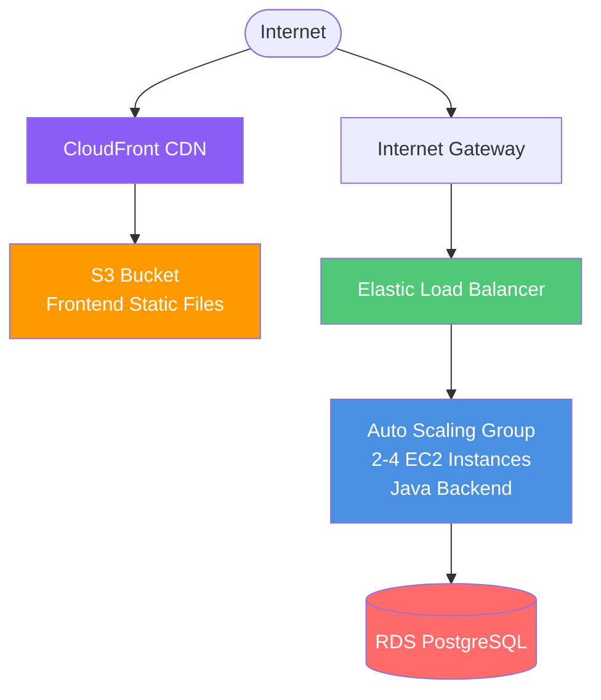

# Elastic Beanstalk Deployment with Terraform

This Terraform configuration deploys the application using AWS Elastic Beanstalk with managed infrastructure and automatic scaling.

## Architecture



## Key Features

- **Platform as a Service (PaaS)**: AWS manages OS, runtime, and infrastructure
- **Auto-Scaling**: Automatic based on metrics
- **Managed Updates**: Automatic platform updates
- **Monitoring**: Integrated CloudWatch dashboards
- **Easy Rollback**: Quick version rollback
- **Multiple Environments**: Dev, staging, prod
- **S3 + CloudFront Frontend**: Cost-effective static hosting

## Resources Created

- **Elastic Beanstalk Application**: Application container
- **Elastic Beanstalk Environment**: Running environment with:
  - Auto Scaling Group (2-4 instances)
  - Elastic Load Balancer
  - EC2 instances (t3.micro)
  - CloudWatch alarms
  - Security groups
- **S3 Bucket**: Frontend static files
- **CloudFront Distribution**: Global CDN for frontend
- **IAM Roles**: For EC2 instances and EB service

## Prerequisites

### 1. Deploy Common Infrastructure

```powershell
cd C:\Users\AyodeleOladeji\Documents\dev\aws-deployment\infrastructure\common\terraform
terraform init
terraform apply
```

Expected outputs: VPC, subnets, RDS, security groups

### 2. Build Backend Application JAR

```powershell
cd C:\Users\AyodeleOladeji\Documents\dev\aws-deployment\backend

# Maven build
mvn clean package -DskipTests

# Verify JAR created
ls target/*.jar
```

Expected: `target/aws-demo-backend-0.0.1-SNAPSHOT.jar` (~50MB)

### 3. Build Frontend for Production

```powershell
cd C:\Users\AyodeleOladeji\Documents\dev\aws-deployment\frontend

# Install dependencies
npm install

# Build (API URL will be configured later)
npm run build
```

Expected: `build/` directory with optimized files

## Configuration

Create or edit `terraform.tfvars`:

```hcl
aws_region   = "eu-west-1"
project_name = "aws-demo"
environment  = "production"

# Elastic Beanstalk Configuration
eb_solution_stack = "64bit Amazon Linux 2023 v4.3.0 running Corretto 17"
instance_type     = "t3.micro"

# Auto Scaling
min_instances     = 2
max_instances     = 4
instance_types    = ["t3.micro", "t3.small"]

# Database Configuration (must match common infrastructure)
db_username = "postgres"
db_password = "TestPassword123!"  # Change in production!
```

### Instance Type Guide

| Type | vCPU | Memory | Use Case | Monthly Cost (2 instances) |
|------|------|--------|----------|---------------------------|
| t3.micro | 2 | 1 GB | Dev/Test | ~$15 |
| t3.small | 2 | 2 GB | Low traffic | ~$30 |
| t3.medium | 2 | 4 GB | Production | ~$60 |

## Deployment Steps

### Step 1: Navigate to Elastic Beanstalk Terraform Directory

```powershell
cd C:\Users\AyodeleOladeji\Documents\dev\aws-deployment\infrastructure\3-elastic-beanstalk\terraform
```

### Step 2: Create terraform.tfvars

```powershell
notepad terraform.tfvars
```

Copy the configuration above and adjust as needed.

### Step 3: Initialize Terraform

```powershell
terraform init
```

**Expected**: "Terraform has been successfully initialized!"

### Step 4: Validate Configuration

```powershell
terraform validate
```

**Expected**: "Success! The configuration is valid."

### Step 5: Preview Changes

```powershell
terraform plan
```

**Expected**: Plan to create ~20-25 resources including:
- Elastic Beanstalk application and environment
- S3 bucket for frontend
- CloudFront distribution
- IAM roles and instance profiles
- Application version

### Step 6: Deploy Elastic Beanstalk Infrastructure

```powershell
terraform apply
```

- Type `yes` when prompted
- **Duration**: ~15-20 minutes (environment creation takes longest)

**Expected output**:
```
Apply complete! Resources: 22 added, 0 changed, 0 destroyed.

Outputs:
eb_environment_url = "aws-demo-production.xxxxx.eu-west-1.elasticbeanstalk.com"
eb_environment_name = "aws-demo-production"
s3_bucket_name = "aws-demo-frontend-291869516835"
cloudfront_domain = "dxxxxx.cloudfront.net"
application_url = "https://dxxxxx.cloudfront.net"
api_url = "http://aws-demo-production.xxxxx.eu-west-1.elasticbeanstalk.com"
```

### Step 7: Deploy Backend Application

```powershell
# Get environment name
$EB_ENV = terraform output -raw eb_environment_name
$AWS_REGION = "eu-west-1"

# Navigate to backend directory
cd C:\Users\AyodeleOladeji\Documents\dev\aws-deployment\backend

# Deploy using EB CLI (if installed)
eb init -p "Corretto 17" aws-demo --region $AWS_REGION
eb use $EB_ENV
eb deploy

# OR upload JAR manually via AWS Console:
# 1. Go to Elastic Beanstalk console
# 2. Select your environment
# 3. Click "Upload and deploy"
# 4. Upload target/*.jar file
```

**Duration**: ~5-8 minutes

### Step 8: Deploy Frontend to S3

```powershell
cd C:\Users\AyodeleOladeji\Documents\dev\aws-deployment\infrastructure\3-elastic-beanstalk\terraform

# Get values
$S3_BUCKET = terraform output -raw s3_bucket_name
$API_URL = terraform output -raw api_url
$CF_DIST_ID = terraform output -raw cloudfront_distribution_id

# Update frontend config with API URL
cd C:\Users\AyodeleOladeji\Documents\dev\aws-deployment\frontend

# Update .env or src/config.js with API_URL
# Then rebuild
npm run build

# Upload to S3
aws s3 sync build/ s3://$S3_BUCKET/ --delete --region eu-west-1

# Invalidate CloudFront cache
aws cloudfront create-invalidation --distribution-id $CF_DIST_ID --paths "/*"
```

**Duration**: ~5-10 minutes (including CloudFront invalidation)

### Step 9: Wait for Environment to be Green

```powershell
$EB_ENV = terraform output -raw eb_environment_name
aws elasticbeanstalk describe-environments --environment-names $EB_ENV --region eu-west-1 --query 'Environments[0].Status'
```

Wait until status is `Ready` and health is `Green`.

## Testing

### Test Frontend

```powershell
$APP_URL = terraform output -raw application_url
Start-Process $APP_URL
```

### Test Backend API

```powershell
$API_URL = terraform output -raw api_url
curl "$API_URL/api/messages"
```

### Check EB Environment Health

```powershell
$EB_ENV = terraform output -raw eb_environment_name
aws elasticbeanstalk describe-environment-health --environment-name $EB_ENV --attribute-names All --region eu-west-1
```

### View Application Logs

```powershell
# Download logs
$EB_ENV = terraform output -raw eb_environment_name
aws elasticbeanstalk request-environment-info --environment-name $EB_ENV --info-type tail --region eu-west-1

# Wait 2 minutes, then retrieve
aws elasticbeanstalk retrieve-environment-info --environment-name $EB_ENV --info-type tail --region eu-west-1
```

Or via EB CLI:
```powershell
eb logs
```

## Updating Application

### Update Backend

```powershell
# 1. Build new JAR
cd C:\Users\AyodeleOladeji\Documents\dev\aws-deployment\backend
mvn clean package -DskipTests

# 2. Deploy using EB CLI
eb deploy

# OR upload via console:
# Elastic Beanstalk → Environment → Upload and deploy
```

**Duration**: ~5-8 minutes

### Update Frontend

```powershell
# 1. Make changes and rebuild
cd C:\Users\AyodeleOladeji\Documents\dev\aws-deployment\frontend
npm run build

# 2. Get S3 bucket and CloudFront ID
cd C:\Users\AyodeleOladeji\Documents\dev\aws-deployment\infrastructure\3-elastic-beanstalk\terraform
$S3_BUCKET = terraform output -raw s3_bucket_name
$CF_DIST_ID = terraform output -raw cloudfront_distribution_id

# 3. Upload to S3
aws s3 sync build/ s3://$S3_BUCKET/ --delete --region eu-west-1

# 4. Invalidate CloudFront
aws cloudfront create-invalidation --distribution-id $CF_DIST_ID --paths "/*"
```

## Scaling

### Manual Scaling

Update `terraform.tfvars`:

```hcl
min_instances = 3
max_instances = 6
```

Then apply:
```powershell
terraform apply
```

### Configure Auto-Scaling Triggers

Edit `.ebextensions/autoscaling.config` (create if not exists):

```yaml
option_settings:
  aws:autoscaling:trigger:
    MeasureName: CPUUtilization
    Statistic: Average
    Unit: Percent
    UpperThreshold: 70
    UpperBreachScaleIncrement: 1
    LowerThreshold: 30
    LowerBreachScaleIncrement: -1
    Period: 5
    EvaluationPeriods: 2
```

## Troubleshooting

### Environment Health is Red/Yellow

```powershell
# Get detailed health info
$EB_ENV = terraform output -raw eb_environment_name
aws elasticbeanstalk describe-environment-health --environment-name $EB_ENV --attribute-names All --region eu-west-1

# Check events
aws elasticbeanstalk describe-events --environment-name $EB_ENV --max-records 20 --region eu-west-1
```

### Application Not Starting

1. Check logs:
   ```powershell
   eb logs
   ```

2. Common issues:
   - Wrong Java version → Check `eb_solution_stack`
   - Missing dependencies → Check JAR is uber/fat JAR
   - Database connection → Verify RDS endpoint in env variables
   - Port mismatch → EB expects port 5000 or from PORT env var

### Deployment Fails

```powershell
# Check deployment status
$EB_ENV = terraform output -raw eb_environment_name
aws elasticbeanstalk describe-events --environment-name $EB_ENV --region eu-west-1
```

If deployment times out:
```powershell
# Abort deployment
eb abort
```

### High Latency

1. Check instance health:
   ```powershell
   $EB_ENV = terraform output -raw eb_environment_name
   aws elasticbeanstalk describe-instances-health --environment-name $EB_ENV --region eu-west-1
   ```

2. Scale up:
   - Increase `min_instances`
   - Use larger `instance_type` (t3.small or t3.medium)

### Frontend Shows Old Content

```powershell
# Invalidate CloudFront cache
$CF_DIST_ID = terraform output -raw cloudfront_distribution_id
aws cloudfront create-invalidation --distribution-id $CF_DIST_ID --paths "/*"
```

## Cost Estimate

Monthly costs (eu-west-1) with default configuration:

| Service | Configuration | Estimated Cost |
|---------|--------------|----------------|
| EC2 Instances | 2 × t3.micro (EB managed) | ~$15.00 |
| Elastic Load Balancer | Classic/Application LB | ~$16.00 |
| S3 Storage | Frontend (100MB) | ~$0.50 |
| CloudFront | 1GB transfer | ~$1.00 |
| EB Service | Free (no extra charge) | $0.00 |
| Data Transfer | Minimal | ~$1.00 |
| **Total (EB layer)** | | **~$33.50/month** |
| **Common Infrastructure** | RDS, VPC | **$15.50/month** |
| **Grand Total** | | **~$49/month** |

### Cost Optimization

1. **Single Instance**: Use `min_instances = 1` for dev: ~$8/month savings
2. **Smaller Instances**: Start with t3.micro, upgrade if needed
3. **Reserved Instances**: Save up to 72% with 3-year commitment
4. **Scheduled Scaling**: Scale down during off-hours

## Advantages of Elastic Beanstalk

✅ **Easy Management**: AWS handles infrastructure
✅ **Platform Updates**: Automatic OS and runtime updates
✅ **Monitoring Built-in**: CloudWatch dashboards included
✅ **Quick Rollback**: Easy version management
✅ **Multiple Environments**: Easy dev/staging/prod setup
✅ **Lower Cost**: Cheaper than ECS/Fargate
✅ **Java Native**: Optimized for Java applications

## Disadvantages

❌ **Less Flexibility**: Limited customization vs EC2
❌ **Platform Lock-in**: AWS-specific deployment
❌ **Slower Updates**: ~5-8 minutes per deployment
❌ **Limited Container Support**: Docker support is basic

## When to Use Elastic Beanstalk

✅ **Use Elastic Beanstalk when**:
- You want PaaS simplicity
- Running Java/Python/Node.js applications
- Need auto-scaling without complexity
- Want AWS-managed infrastructure
- Team is not container-expert

❌ **Don't use Elastic Beanstalk when**:
- Need fine-grained control (use EC2)
- Using complex microservices (use ECS/EKS)
- Multi-cloud deployment needed
- Want cutting-edge features (use App Runner)

## Cleanup

```powershell
# Empty S3 bucket first
$S3_BUCKET = terraform output -raw s3_bucket_name
aws s3 rm s3://$S3_BUCKET/ --recursive

# Destroy infrastructure
terraform destroy
```

Type `yes` when prompted.

⚠️ **Warning**: 
- Environment termination takes ~10-15 minutes
- CloudFront deletion takes additional 15-20 minutes
- Common infrastructure (VPC, RDS) remains

## Migration Path

**From EC2 to Elastic Beanstalk**:
1. Package application as JAR
2. Create Elastic Beanstalk environment
3. Upload JAR
4. Update DNS

**From Elastic Beanstalk to**:
- **ECS**: Containerize application first
- **App Runner**: Container-based deployment
- **Lambda**: Refactor to serverless

## Additional Resources

- [AWS Elastic Beanstalk Documentation](https://docs.aws.amazon.com/elasticbeanstalk/)
- [EB CLI Documentation](https://docs.aws.amazon.com/elasticbeanstalk/latest/dg/eb-cli3.html)
- [Platform Versions](https://docs.aws.amazon.com/elasticbeanstalk/latest/platforms/)
- [Best Practices](https://docs.aws.amazon.com/elasticbeanstalk/latest/dg/best-practices.html)
