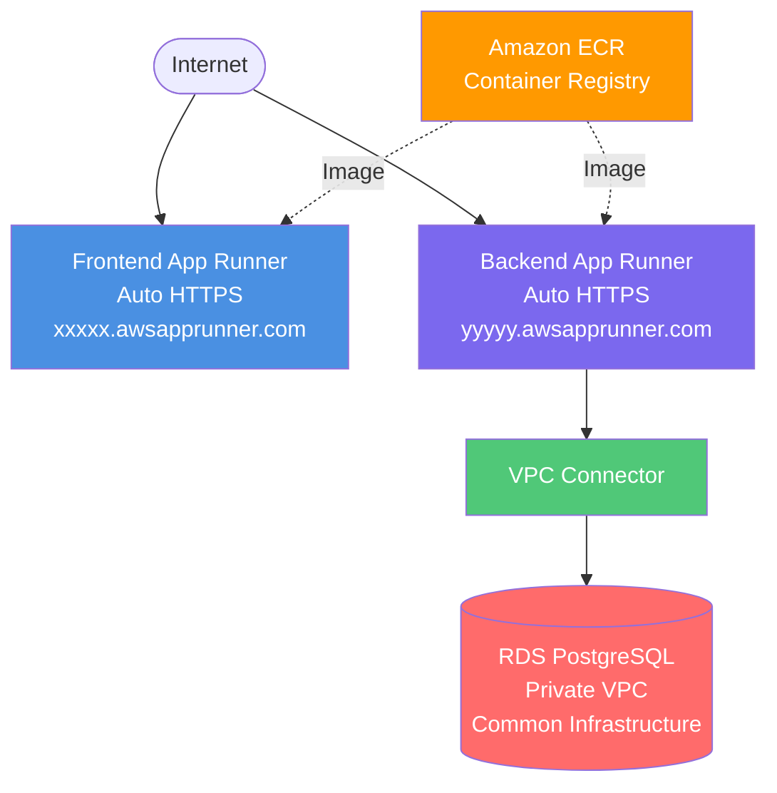

# AWS App Runner Deployment

Deploy your application using AWS App Runner - the simplest serverless container deployment.

## Overview

App Runner is AWS's simplest container deployment service. It's fully serverless, provides automatic HTTPS, auto-scaling, and you only pay for active compute time. Both frontend and backend run as containerized services with unique App Runner URLs.

## Architecture



**Key Components**:

## Deployment Options

### Manual Deployment
Follow [manual-steps.md](manual-steps.md) for AWS CLI-based deployment.

**Time**: ~20-30 minutes  
**Skill Level**: Beginner to Intermediate

### Terraform Deployment
Follow [terraform/README.md](terraform/README.md) for infrastructure-as-code deployment.

**Time**: ~10-15 minutes  
**Skill Level**: Intermediate  
**Repeatability**: High (version controlled)

## When to Choose App Runner

✅ **Choose App Runner if**:
- You want the simplest deployment
- Traffic is variable/bursty
- Need fast deployments (CI/CD)
- Team has limited AWS experience
- Running small to medium apps
- Cost optimization for low traffic
- Want automatic HTTPS
- Don't need custom load balancer

❌ **Don't choose App Runner if**:
- Need 24/7 high traffic (use ECS/EC2 - cheaper)
- Require fine-grained control
- Need custom load balancer config
- Multi-region deployment required
- Very large applications (>4 vCPU)

## Cost Estimate

### Low Traffic (Dev/Test - 8% uptime)
**Monthly Cost**: ~$31.50/month total
- Backend App Runner: ~$5/month
- Frontend App Runner: ~$4/month
- VPC Connector: ~$7/month
- Common Infrastructure (RDS, ECR): ~$15.50/month

### Moderate Traffic (50% uptime)
**Monthly Cost**: ~$69.50/month total
- Backend App Runner: ~$28/month
- Frontend App Runner: ~$19/month
- VPC Connector: ~$7/month
- Common Infrastructure: ~$15.50/month

### High Traffic (100% uptime)
**Monthly Cost**: ~$134.50/month total
- Backend App Runner: ~$56/month
- Frontend App Runner: ~$56/month
- VPC Connector: ~$7/month
- Common Infrastructure: ~$15.50/month

**Best For**: Variable traffic patterns where you pay only for what you use

## Key Features

- ✅ Fully serverless - No infrastructure management
- ✅ Auto-scaling - Automatic based on traffic
- ✅ Auto HTTPS - Free SSL/TLS certificates
- ✅ Auto deployments - CI/CD from ECR
- ✅ Pay per use - Only pay for active compute time
- ✅ Fast deployments - 2-4 minutes average
- ✅ Built-in load balancing - Automatic
- ✅ Health checks - Automatic container monitoring

## Quick Start

1. **Deploy common infrastructure**:
   ```powershell
   cd ..\common\terraform
   terraform apply
   ```

2. **Build and push Docker images** to ECR

3. **Choose deployment method**:
   - **Manual**: See [manual-steps.md](manual-steps.md)
   - **Terraform**: See [terraform/README.md](terraform/README.md)

4. **Update frontend** with backend App Runner URL

5. **Test your application**

## Comparison with Other Options

| Feature | App Runner | EC2 | ECS | Elastic Beanstalk |
|---------|-----------|-----|-----|-------------------|
| Management | None | High | Low | Low |
| Setup Time | 5 min | 10 min | 12 min | 20 min |
| Cost (Low Traffic) | $31 | $47 | $81 | $49 |
| Cost (High Traffic) | $134 | $47 | $81 | $49 |
| Scaling | Auto | Manual | Auto | Auto |
| Deployment | 2-4 min | 5-10 min | 8-12 min | 15-20 min |
| HTTPS | Free | Setup needed | Setup needed | Setup needed |
| Best For | Variable Traffic | Always-on | Containers | Traditional |

## Scaling Behavior

App Runner automatically scales based on:
- **Concurrent requests per instance** (default: 100)
- **Instance count** (min: 1, max: 10)

Example:
- 50 concurrent requests → 1 instance
- 150 concurrent requests → 2 instances
- 500 concurrent requests → 5 instances

New instances ready in ~30-60 seconds.

## Cold Starts

- **First request after idle**: ~2-5 seconds
- **Subsequent requests**: <100ms
- **Mitigation**: Set `min_instances = 2` for always-warm service

## Next Steps

- [Manual Deployment Guide](manual-steps.md)
- [Terraform Deployment Guide](terraform/README.md)
- [Back to Infrastructure Overview](../README.md)

## Quick Decision Guide

**Choose App Runner if**:
- ⏰ Fast deployment is priority
- 📊 Traffic is variable/unpredictable
- 💰 Cost optimization for low traffic
- 🚀 Simplicity is key
- 🔒 Need auto HTTPS

**Choose ECS/EC2 if**:
- 💵 Cost optimization for 24/7 workloads
- 🎛️ Need fine-grained control
- 🏗️ Complex architecture
- 📈 Predictable high traffic
