# AWS App Runner Deployment Guide

## Overview

This option deploys the application using AWS App Runner:
- **Backend**: App Runner service from ECR image
- **Frontend**: App Runner service from ECR image OR S3 + CloudFront
- **Database**: RDS PostgreSQL with VPC Connector

## Architecture

### High-Level Overview

```mermaid
graph TB
    Internet[🌐 Internet]
    
    subgraph AppRunner["☁️ AWS App Runner (Serverless)"]
        Frontend[🎨 Frontend Service<br/>Auto HTTPS<br/>xxxxx.awsapprunner.com<br/>Nginx:80]
        Backend[⚙️ Backend Service<br/>Auto HTTPS<br/>yyyyy.awsapprunner.com<br/>Spring Boot:8080]
    end
    
    VPCConn[🔌 VPC Connector]
    
    subgraph VPC["🏢 VPC (Private)"]
        RDS[(🗄️ RDS PostgreSQL<br/>Private Subnet<br/>Port 5432)]
    end
    
    Internet --> Frontend
    Internet --> Backend
    Backend --> VPCConn
    VPCConn --> RDS
    
    style Internet fill:#e1f5ff
    style AppRunner fill:#f1f8e9
    style Frontend fill:#e1bee7
    style Backend fill:#c8e6c9
    style VPCConn fill:#fff3e0
    style VPC fill:#ffcdd2
```



### Detailed Architecture with App Runner

```mermaid
graph TB
    subgraph Internet
        Users[👥 Users]
    end
    
    subgraph Frontend_Service["🎨 App Runner: Frontend Service"]
        FrontendURL[🌐 https://xxxxx.awsapprunner.com<br/>Auto-Generated Domain<br/>Automatic HTTPS/TLS]
        
        subgraph FrontendConfig["⚙️ Configuration"]
            FConfig[Port: 80<br/>CPU: 0.25 vCPU<br/>Memory: 0.5 GB<br/>Auto-Scale: 1-10<br/>Health: / ]
        end
        
        subgraph FrontendTasks["🐳 Container Instances<br/>(Managed by App Runner)"]
            FTask1[Nginx:80<br/>React SPA]
            FTask2[Nginx:80<br/>React SPA]
        end
    end
    
    subgraph Backend_Service["⚙️ App Runner: Backend Service"]
        BackendURL[🌐 https://yyyyy.awsapprunner.com<br/>Auto-Generated Domain<br/>Automatic HTTPS/TLS]
        
        subgraph BackendConfig["⚙️ Configuration"]
            BConfig[Port: 8080<br/>CPU: 0.25 vCPU<br/>Memory: 0.5 GB<br/>Auto-Scale: 1-10<br/>Health: /api/messages<br/>Env: DATABASE_URL, etc.]
        end
        
        subgraph BackendTasks["🐳 Container Instances<br/>(Managed by App Runner)"]
            BTask1[Spring Boot:8080]
            BTask2[Spring Boot:8080]
        end
        
        VPCConnector[🔌 VPC Connector<br/>• Subnets: 10.0.1.0/24<br/>• Security Group: app-runner-sg<br/>• Enables private VPC access]
    end
    
    subgraph VPC["🏢 VPC (10.0.0.0/16)"]
        subgraph PrivateSubnets["🔒 Private Subnets<br/>10.0.10.0/24, 10.0.11.0/24"]
            RDS[(🗄️ RDS PostgreSQL<br/>db.t3.micro<br/>Engine: 18.1<br/>SG: rds-sg<br/>Port: 5432<br/>NOT public)]
        end
    end
    
    subgraph External["☁️ AWS Managed Services"]
        ECR[📦 Amazon ECR<br/>• frontend:latest<br/>• backend:latest]
        AppRunnerControl[🎛️ App Runner Control<br/>• Auto-scaling<br/>• Health monitoring<br/>• Zero-downtime deploys<br/>• Automatic HTTPS]
    end
    
    Users -->|Frontend Requests| FrontendURL
    Users -->|API Requests| BackendURL
    
    FrontendURL --> FrontendTasks
    BackendURL --> BackendTasks
    
    BackendTasks --> VPCConnector
    VPCConnector --> RDS
    
    FTask1 -.->|Pull Image| ECR
    FTask2 -.->|Pull Image| ECR
    BTask1 -.->|Pull Image| ECR
    BTask2 -.->|Pull Image| ECR
    
    AppRunnerControl -.->|Manages| FrontendTasks
    AppRunnerControl -.->|Manages| BackendTasks
    
    style Frontend_Service fill:#e1f5ff
    style Backend_Service fill:#c8e6c9
    style VPC fill:#ffcdd2
    style External fill:#f3e5f5
```



### Auto-Scaling Behavior

```mermaid
graph LR
    subgraph Metrics["📊 Metrics"]
        Requests[Concurrent<br/>Requests]
        CPU[CPU Usage]
        Memory[Memory Usage]
    end
    
    subgraph Scaling["📈 Scaling Logic"]
        Evaluate[Concurrency Target:<br/>100 requests/instance]
        ScaleUp[⬆️ Scale Up<br/>If exceeds target]
        ScaleDown[⬇️ Scale Down<br/>If below target]
    end
    
    subgraph Limits["🎚️ Limits"]
        Min[Minimum: 1 instance<br/>Always running]
        Max[Maximum: 10 instances<br/>Cost protection]
    end
    
    Requests --> Evaluate
    CPU --> Evaluate
    Memory --> Evaluate
    
    Evaluate --> ScaleUp
    Evaluate --> ScaleDown
    
    ScaleUp --> Max
    ScaleDown --> Min
    
    style Metrics fill:#e3f2fd
    style Scaling fill:#c8e6c9
    style Limits fill:#fff3e0
```



### Traffic Flow


**Key App Runner Concepts:**

• **Fully Managed Serverless**: No infrastructure to manage (no EC2, no ECS clusters)
• **Auto HTTPS**: SSL/TLS certificates provisioned and renewed automatically
• **Auto-Scaling**: Based on concurrent requests per instance (default: 100)
• **VPC Connector**: Enables App Runner to access resources in private VPC subnets
• **Source Types**: ECR image, GitHub, or Bitbucket repository
• **Zero Downtime Deploys**: Blue/green deployments built-in
• **Per-Request Pricing**: Pay for compute time + active instances + requests

### Detailed Architecture with App Runner Services
```
┌─────────────────────────────────────────────────────────────────────────────┐
│                               Internet Users                                 │
└──────────────────┬───────────────────────────────────┬──────────────────────┘
                   │                                   │
**Key App Runner Concepts:**

• **Fully Managed**: No infrastructure management (serverless containers)
• **Auto HTTPS**: SSL/TLS certificates provisioned automatically
• **Auto Scaling**: Based on concurrent requests (configurable)
• **VPC Connector**: Allows App Runner to access private VPC resources (RDS)
• **Source Types**: ECR image, GitHub repository, or Bitbucket
• **Deployment**: Automatic on image push to ECR (or manual trigger)

**Networking Details:**

• **Frontend Service**: Public internet → No VPC connector needed
• **Backend Service**: 
  - Public internet access for API requests
  - VPC connector for private database access
  - Outbound traffic goes through VPC subnets

**Security:**

• Each service has its own IAM instance role
• Environment variables encrypted at rest
• HTTPS enforced (HTTP redirects to HTTPS)
• VPC security groups control database access

**Traffic Flow:**

**Frontend:**
1. User → `https://xxxxx.awsapprunner.com` (auto HTTPS)
2. App Runner → Routes to frontend container instance
3. Nginx serves React static files
4. JavaScript makes API calls to backend App Runner URL

**Backend:**
1. Frontend JavaScript → `https://yyyyy.awsapprunner.com/api/messages`
2. App Runner → Routes to backend container instance
3. Spring Boot → Via VPC Connector → RDS in private subnet
4. Response flows back through App Runner → Frontend

**Scaling Behavior:**
• Concurrency target: 100 requests per instance (configurable)
• If traffic exceeds capacity → Auto-scale up (max: 10 instances)
• If traffic decreases → Scale down to min: 1 instance
• Scale-to-zero: Not supported (min 1 instance always running)
```

## Cost Estimate (us-east-1)

| Resource | Configuration | Monthly Cost |
|----------|---------------|--------------|
| App Runner Backend | 0.25 vCPU, 0.5GB (provisioned) | ~$15 |
| App Runner Frontend | 0.25 vCPU, 0.5GB | ~$15 |
| RDS PostgreSQL | db.t3.micro | ~$13 |
| VPC Connector | - | ~$0 |
| **Total** | | **~$43/month** |

*Note: App Runner also charges per request ($0.000007/request) which can add up*

## Advantages of App Runner

✅ Simplest deployment option
✅ Automatic HTTPS certificates
✅ Built-in auto-scaling (including scale to zero)
✅ No infrastructure to manage
✅ Automatic deployments from ECR
✅ Pay per use (can scale to zero)

## Disadvantages

❌ Limited customization
❌ No control over load balancer settings
❌ Requires VPC Connector for private resources
❌ Higher per-request costs at scale
❌ Limited to container or source code deployments

---

# Manual Deployment Steps

## Prerequisites

1. Docker images pushed to ECR
2. AWS CLI configured
3. VPC with private subnets for RDS

## Step 1: Push Docker Images to ECR

```bash
# Get AWS account ID and region
export AWS_ACCOUNT_ID=$(aws sts get-caller-identity --query Account --output text)
export AWS_REGION=us-east-1

# Login to ECR
aws ecr get-login-password --region $AWS_REGION | docker login --username AWS --password-stdin $AWS_ACCOUNT_ID.dkr.ecr.$AWS_REGION.amazonaws.com

# Build and push backend
cd backend
docker build -t aws-demo-backend .
docker tag aws-demo-backend:latest $AWS_ACCOUNT_ID.dkr.ecr.$AWS_REGION.amazonaws.com/aws-demo-backend:latest
docker push $AWS_ACCOUNT_ID.dkr.ecr.$AWS_REGION.amazonaws.com/aws-demo-backend:latest

# Build and push frontend
cd ../frontend
docker build -t aws-demo-frontend .
docker tag aws-demo-frontend:latest $AWS_ACCOUNT_ID.dkr.ecr.$AWS_REGION.amazonaws.com/aws-demo-frontend:latest
docker push $AWS_ACCOUNT_ID.dkr.ecr.$AWS_REGION.amazonaws.com/aws-demo-frontend:latest
```

## Step 2: Create IAM Role for App Runner ECR Access

```bash
# Create trust policy
cat > apprunner-trust-policy.json << 'EOF'
{
  "Version": "2012-10-17",
  "Statement": [
    {
      "Effect": "Allow",
      "Principal": {
        "Service": "build.apprunner.amazonaws.com"
      },
      "Action": "sts:AssumeRole"
    }
  ]
}
EOF

# Create role
aws iam create-role \
  --role-name aws-demo-apprunner-ecr-role \
  --assume-role-policy-document file://apprunner-trust-policy.json

# Attach ECR policy
aws iam attach-role-policy \
  --role-name aws-demo-apprunner-ecr-role \
  --policy-arn arn:aws:iam::aws:policy/service-role/AWSAppRunnerServicePolicyForECRAccess

# Get role ARN
export ECR_ACCESS_ROLE_ARN=$(aws iam get-role --role-name aws-demo-apprunner-ecr-role --query 'Role.Arn' --output text)
```

## Step 3: Create VPC Connector (for RDS access)

```bash
# Create VPC Connector
aws apprunner create-vpc-connector \
  --vpc-connector-name aws-demo-vpc-connector \
  --subnets subnet-xxxxx subnet-yyyyy \
  --security-groups sg-xxxxx

export VPC_CONNECTOR_ARN=$(aws apprunner list-vpc-connectors --query "VpcConnectors[?VpcConnectorName=='aws-demo-vpc-connector'].VpcConnectorArn" --output text)
```

## Step 4: Create Backend App Runner Service

```bash
cat > backend-apprunner.json << EOF
{
  "ServiceName": "aws-demo-backend",
  "SourceConfiguration": {
    "AuthenticationConfiguration": {
      "AccessRoleArn": "$ECR_ACCESS_ROLE_ARN"
    },
    "AutoDeploymentsEnabled": true,
    "ImageRepository": {
      "ImageIdentifier": "$AWS_ACCOUNT_ID.dkr.ecr.$AWS_REGION.amazonaws.com/aws-demo-backend:latest",
      "ImageRepositoryType": "ECR",
      "ImageConfiguration": {
        "Port": "8080",
        "RuntimeEnvironmentVariables": {
          "DATABASE_URL": "jdbc:postgresql://YOUR_RDS_ENDPOINT:5432/awsdemo",
          "DATABASE_USER": "postgres",
          "DATABASE_PASSWORD": "YourSecurePassword123"
        }
      }
    }
  },
  "InstanceConfiguration": {
    "Cpu": "0.25 vCPU",
    "Memory": "0.5 GB"
  },
  "NetworkConfiguration": {
    "EgressConfiguration": {
      "EgressType": "VPC",
      "VpcConnectorArn": "$VPC_CONNECTOR_ARN"
    }
  },
  "HealthCheckConfiguration": {
    "Protocol": "HTTP",
    "Path": "/api/messages",
    "Interval": 10,
    "Timeout": 5,
    "HealthyThreshold": 1,
    "UnhealthyThreshold": 5
  },
  "AutoScalingConfigurationArn": "arn:aws:apprunner:$AWS_REGION:$AWS_ACCOUNT_ID:autoscalingconfiguration/DefaultConfiguration/1/00000000000000000000000000000001"
}
EOF

aws apprunner create-service --cli-input-json file://backend-apprunner.json

# Wait for service to be running
aws apprunner list-services --query "ServiceSummaryList[?ServiceName=='aws-demo-backend'].Status" --output text
```

## Step 5: Create Frontend App Runner Service

```bash
# Get backend URL first
export BACKEND_URL=$(aws apprunner list-services --query "ServiceSummaryList[?ServiceName=='aws-demo-backend'].ServiceUrl" --output text)

cat > frontend-apprunner.json << EOF
{
  "ServiceName": "aws-demo-frontend",
  "SourceConfiguration": {
    "AuthenticationConfiguration": {
      "AccessRoleArn": "$ECR_ACCESS_ROLE_ARN"
    },
    "AutoDeploymentsEnabled": true,
    "ImageRepository": {
      "ImageIdentifier": "$AWS_ACCOUNT_ID.dkr.ecr.$AWS_REGION.amazonaws.com/aws-demo-frontend:latest",
      "ImageRepositoryType": "ECR",
      "ImageConfiguration": {
        "Port": "80"
      }
    }
  },
  "InstanceConfiguration": {
    "Cpu": "0.25 vCPU",
    "Memory": "0.5 GB"
  },
  "HealthCheckConfiguration": {
    "Protocol": "HTTP",
    "Path": "/",
    "Interval": 10,
    "Timeout": 5,
    "HealthyThreshold": 1,
    "UnhealthyThreshold": 5
  }
}
EOF

aws apprunner create-service --cli-input-json file://frontend-apprunner.json
```

## Step 6: Update Frontend Configuration

> ⚠️ **IMPORTANT**: With App Runner, each service gets its own URL. The frontend needs to know the backend URL.

**Option A: Use environment variable in React (Recommended)**

This avoids nginx proxy issues and calls the backend directly:

```bash
# Rebuild frontend with backend URL
cd frontend

# Get backend URL
export BACKEND_URL=$(aws apprunner list-services --query "ServiceSummaryList[?ServiceName=='aws-demo-backend'].ServiceUrl" --output text)
echo "Backend URL: https://$BACKEND_URL"

# Create production environment file
echo "VITE_API_URL=https://$BACKEND_URL" > .env.production

# Rebuild and push
npm run build
docker build -t aws-demo-frontend .
docker tag aws-demo-frontend:latest $AWS_ACCOUNT_ID.dkr.ecr.$AWS_REGION.amazonaws.com/aws-demo-frontend:latest
docker push $AWS_ACCOUNT_ID.dkr.ecr.$AWS_REGION.amazonaws.com/aws-demo-frontend:latest

# App Runner will auto-deploy
cd ..
```

**Option B: Nginx proxy (more complex)**

> ⚠️ Make sure `frontend/nginx.conf` does NOT have a proxy to `http://backend:8080` - that only works with docker-compose.

If you need nginx to proxy, update it to proxy to the App Runner backend URL:

```nginx
server {
    listen 80;
    root /usr/share/nginx/html;
    index index.html;

    location / {
        try_files $uri $uri/ /index.html;
    }

    # Proxy API to backend App Runner service
    location /api {
        proxy_pass https://YOUR_BACKEND_SERVICE_URL;
        proxy_set_header Host YOUR_BACKEND_SERVICE_URL;
        proxy_ssl_server_name on;
    }
}
```

## Step 7: Configure Custom Auto Scaling (Optional)

```bash
cat > autoscaling-config.json << 'EOF'
{
  "AutoScalingConfigurationName": "aws-demo-autoscaling",
  "MaxConcurrency": 100,
  "MinSize": 1,
  "MaxSize": 10
}
EOF

aws apprunner create-auto-scaling-configuration --cli-input-json file://autoscaling-config.json

# Update service with new config
aws apprunner update-service \
  --service-arn YOUR_SERVICE_ARN \
  --auto-scaling-configuration-arn YOUR_AUTOSCALING_ARN
```

## Step 8: Test the Deployment

```bash
# Get service URLs
aws apprunner list-services --query "ServiceSummaryList[*].[ServiceName,ServiceUrl]" --output table

# Test backend
curl https://YOUR_BACKEND_URL/api/messages

# Test frontend
curl https://YOUR_FRONTEND_URL/
```

---

# Alternative: Frontend on S3 + CloudFront

For better performance and cost efficiency, deploy frontend to S3:

```bash
cd frontend
npm run build

# Create S3 bucket
aws s3 mb s3://aws-demo-frontend-$AWS_ACCOUNT_ID

# Upload files
aws s3 sync dist/ s3://aws-demo-frontend-$AWS_ACCOUNT_ID --delete

# Create CloudFront distribution pointing to:
# - S3 for static files (default)
# - App Runner backend for /api/*
```

---

# Updating Services

App Runner automatically deploys when you push new images to ECR:

```bash
# Push new backend image
docker build -t aws-demo-backend ./backend
docker push $AWS_ACCOUNT_ID.dkr.ecr.$AWS_REGION.amazonaws.com/aws-demo-backend:latest

# App Runner detects and deploys automatically!
# Or trigger manual deployment:
aws apprunner start-deployment --service-arn YOUR_SERVICE_ARN
```

---

# Viewing Logs

```bash
# View logs in CloudWatch
aws logs describe-log-groups --log-group-name-prefix /aws/apprunner

# Stream logs
aws logs tail /aws/apprunner/aws-demo-backend/YOUR_SERVICE_ID/application --follow
```

---

# Cleanup

```bash
# Delete App Runner services
aws apprunner delete-service --service-arn $(aws apprunner list-services --query "ServiceSummaryList[?ServiceName=='aws-demo-backend'].ServiceArn" --output text)
aws apprunner delete-service --service-arn $(aws apprunner list-services --query "ServiceSummaryList[?ServiceName=='aws-demo-frontend'].ServiceArn" --output text)

# Delete VPC Connector
aws apprunner delete-vpc-connector --vpc-connector-arn $VPC_CONNECTOR_ARN

# Delete IAM role
aws iam detach-role-policy --role-name aws-demo-apprunner-ecr-role --policy-arn arn:aws:iam::aws:policy/service-role/AWSAppRunnerServicePolicyForECRAccess
aws iam delete-role --role-name aws-demo-apprunner-ecr-role
```
