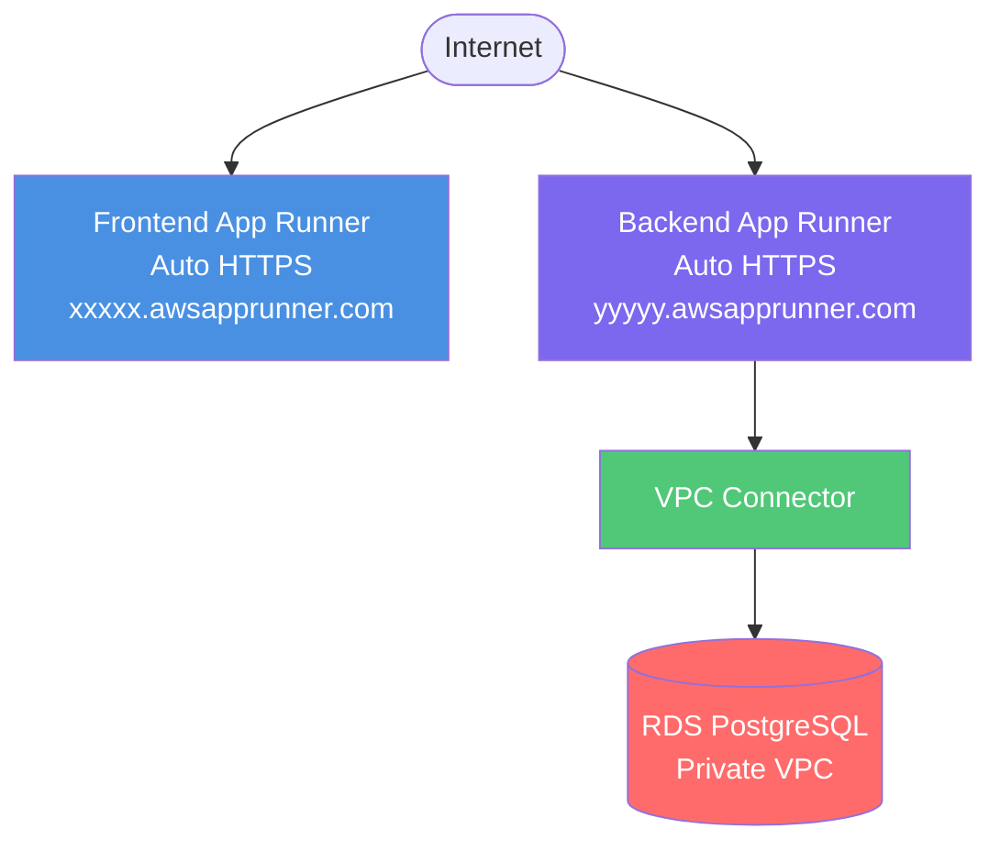

# AWS App Runner Deployment with Terraform

This Terraform configuration deploys the application using AWS App Runner - the simplest serverless container deployment option.

## Architecture



## Key Features

- **Fully Serverless**: No infrastructure to manage
- **Auto-Scaling**: Automatic based on traffic
- **Auto HTTPS**: Free SSL/TLS certificates
- **Auto Deployments**: CI/CD from ECR
- **Pay Per Use**: Only pay for requests and compute time
- **Fast Deployments**: ~2-4 minutes
- **Built-in Load Balancing**: Automatic traffic distribution
- **Health Checks**: Automatic container health monitoring

## Resources Created

- **2 App Runner Services**: Frontend and backend
- **VPC Connector**: Connects App Runner to RDS in VPC
- **IAM Roles**: For App Runner to access ECR
- **Security Groups**: For VPC connector
- **Auto-Scaling Configuration**: Built into App Runner

## Prerequisites

### 1. Deploy Common Infrastructure

```powershell
cd C:\Users\AyodeleOladeji\Documents\dev\aws-deployment\infrastructure\common\terraform
terraform init
terraform apply
```

Expected outputs: VPC, subnets, RDS, ECR repositories, security groups

### 2. Build and Push Docker Images to ECR

```powershell
# Get ECR URLs
cd C:\Users\AyodeleOladeji\Documents\dev\aws-deployment\infrastructure\common\terraform
$ECR_BACKEND = terraform output -raw ecr_backend_url
$ECR_FRONTEND = terraform output -raw ecr_frontend_url
$AWS_REGION = "eu-west-1"
$ACCOUNT_ID = (terraform output -raw ecr_backend_url).Split('.')[0]

# Authenticate Docker to ECR
aws ecr get-login-password --region $AWS_REGION | docker login --username AWS --password-stdin "$ACCOUNT_ID.dkr.ecr.$AWS_REGION.amazonaws.com"

# Build and push backend
cd C:\Users\AyodeleOladeji\Documents\dev\aws-deployment\backend
docker build -t aws-demo-backend .
docker tag aws-demo-backend:latest "$ECR_BACKEND:latest"
docker push "$ECR_BACKEND:latest"

# Build and push frontend
cd C:\Users\AyodeleOladeji\Documents\dev\aws-deployment\frontend
docker build -t aws-demo-frontend .
docker tag aws-demo-frontend:latest "$ECR_FRONTEND:latest"
docker push "$ECR_FRONTEND:latest"
```

⚠️ **Important**: Images must exist in ECR before deploying App Runner services.

## Configuration

Create or edit `terraform.tfvars`:

```hcl
aws_region   = "eu-west-1"
project_name = "aws-demo"

# App Runner Configuration
backend_cpu    = 1024  # 1 vCPU
backend_memory = 2048  # 2 GB
backend_port   = 8080

frontend_cpu    = 1024  # 1 vCPU
frontend_memory = 2048  # 2 GB
frontend_port   = 80

# Auto-Scaling
backend_max_concurrency  = 100  # Requests per instance
backend_min_instances    = 1
backend_max_instances    = 10

frontend_max_concurrency = 100
frontend_min_instances   = 1
frontend_max_instances   = 10

# Database Configuration (must match common infrastructure)
db_username = "postgres"
db_password = "TestPassword123!"  # Change in production!
```

### Resource Sizing Guide

| CPU | Memory | Use Case | Cost per vCPU-hour | Cost per GB-hour |
|-----|--------|----------|-------------------|------------------|
| 1024 (1 vCPU) | 2048 MB | Small apps | $0.064 | $0.007 |
| 2048 (2 vCPU) | 4096 MB | Medium apps | $0.064 | $0.007 |
| 4096 (4 vCPU) | 12288 MB | Large apps | $0.064 | $0.007 |

**Pricing**: Pay only for active compute time + $0.007/GB-month for provisioned memory

## Deployment Steps

### Step 1: Navigate to App Runner Terraform Directory

```powershell
cd C:\Users\AyodeleOladeji\Documents\dev\aws-deployment\infrastructure\4-app-runner\terraform
```

### Step 2: Create terraform.tfvars

```powershell
notepad terraform.tfvars
```

Copy the configuration above and adjust as needed.

### Step 3: Initialize Terraform

```powershell
terraform init
```

**Expected**: "Terraform has been successfully initialized!"

### Step 4: Validate Configuration

```powershell
terraform validate
```

**Expected**: "Success! The configuration is valid."

### Step 5: Preview Changes

```powershell
terraform plan
```

**Expected**: Plan to create ~8-10 resources including:
- VPC connector
- 2 App Runner services
- IAM roles
- Auto-scaling configurations

### Step 6: Deploy App Runner Infrastructure

```powershell
terraform apply
```

- Type `yes` when prompted
- **Duration**: ~4-6 minutes (fastest option!)

**Expected output**:
```
Apply complete! Resources: 9 added, 0 changed, 0 destroyed.

Outputs:
backend_url = "https://xxxxx.eu-west-1.awsapprunner.com"
frontend_url = "https://yyyyy.eu-west-1.awsapprunner.com"
application_url = "https://yyyyy.eu-west-1.awsapprunner.com"
backend_service_arn = "arn:aws:apprunner:..."
frontend_service_arn = "arn:aws:apprunner:..."
```

### Step 7: Wait for Services to be Running

```powershell
# Check backend service status
$BACKEND_ARN = terraform output -raw backend_service_arn
aws apprunner describe-service --service-arn $BACKEND_ARN --region eu-west-1 --query 'Service.Status'

# Check frontend service status
$FRONTEND_ARN = terraform output -raw frontend_service_arn
aws apprunner describe-service --service-arn $FRONTEND_ARN --region eu-west-1 --query 'Service.Status'
```

Wait until both show `RUNNING` (~2-3 minutes).

### Step 8: Update Frontend Configuration

App Runner provides unique URLs, so you need to update the frontend to use the backend URL:

```powershell
# Get backend URL
$BACKEND_URL = terraform output -raw backend_url

# Update frontend code with backend URL
cd C:\Users\AyodeleOladeji\Documents\dev\aws-deployment\frontend

# Edit src/config.js or .env to use $BACKEND_URL
# Rebuild and push new image
docker build -t aws-demo-frontend .

# Get ECR URL and push
cd C:\Users\AyodeleOladeji\Documents\dev\aws-deployment\infrastructure\common\terraform
$ECR_FRONTEND = terraform output -raw ecr_frontend_url
docker tag aws-demo-frontend:latest "$ECR_FRONTEND:latest"
docker push "$ECR_FRONTEND:latest"

# Trigger redeployment in App Runner
cd C:\Users\AyodeleOladeji\Documents\dev\aws-deployment\infrastructure\4-app-runner\terraform
$FRONTEND_ARN = terraform output -raw frontend_service_arn
aws apprunner start-deployment --service-arn $FRONTEND_ARN --region eu-west-1
```

**Duration**: ~2-3 minutes

## Testing

### Test Frontend

```powershell
$APP_URL = terraform output -raw application_url
Start-Process $APP_URL
```

### Test Backend API

```powershell
$BACKEND_URL = terraform output -raw backend_url
curl "$BACKEND_URL/api/messages"
```

### Check Service Status

```powershell
# Backend
$BACKEND_ARN = terraform output -raw backend_service_arn
aws apprunner describe-service --service-arn $BACKEND_ARN --region eu-west-1

# Frontend
$FRONTEND_ARN = terraform output -raw frontend_service_arn
aws apprunner describe-service --service-arn $FRONTEND_ARN --region eu-west-1
```

### View Application Logs

```powershell
# Backend logs (requires service ARN)
$BACKEND_ARN = terraform output -raw backend_service_arn
aws logs tail /aws/apprunner/$BACKEND_ARN/application --follow --region eu-west-1

# Frontend logs
$FRONTEND_ARN = terraform output -raw frontend_service_arn
aws logs tail /aws/apprunner/$FRONTEND_ARN/application --follow --region eu-west-1
```

## Updating Application

### Update Backend

```powershell
# 1. Make code changes and rebuild
cd C:\Users\AyodeleOladeji\Documents\dev\aws-deployment\backend
docker build -t aws-demo-backend .

# 2. Get ECR URL
cd C:\Users\AyodeleOladeji\Documents\dev\aws-deployment\infrastructure\common\terraform
$ECR_BACKEND = terraform output -raw ecr_backend_url

# 3. Push to ECR
docker tag aws-demo-backend:latest "$ECR_BACKEND:latest"
docker push "$ECR_BACKEND:latest"

# 4. App Runner auto-deploys on ECR push (if configured)
# OR trigger manual deployment:
cd C:\Users\AyodeleOladeji\Documents\dev\aws-deployment\infrastructure\4-app-runner\terraform
$BACKEND_ARN = terraform output -raw backend_service_arn
aws apprunner start-deployment --service-arn $BACKEND_ARN --region eu-west-1
```

**Duration**: ~2-3 minutes (fastest deployment!)

### Update Frontend

```powershell
# 1. Make changes and rebuild
cd C:\Users\AyodeleOladeji\Documents\dev\aws-deployment\frontend
docker build -t aws-demo-frontend .

# 2. Get ECR URL
cd C:\Users\AyodeleOladeji\Documents\dev\aws-deployment\infrastructure\common\terraform
$ECR_FRONTEND = terraform output -raw ecr_frontend_url

# 3. Push to ECR
docker tag aws-demo-frontend:latest "$ECR_FRONTEND:latest"
docker push "$ECR_FRONTEND:latest"

# 4. Trigger deployment
cd C:\Users\AyodeleOladeji\Documents\dev\aws-deployment\infrastructure\4-app-runner\terraform
$FRONTEND_ARN = terraform output -raw frontend_service_arn
aws apprunner start-deployment --service-arn $FRONTEND_ARN --region eu-west-1
```

## Scaling

### Automatic Scaling (Already Configured)

App Runner automatically scales based on:
- Concurrent requests per instance (`max_concurrency`)
- Instance count (`min_instances` to `max_instances`)

No manual intervention needed!

### Adjust Scaling Settings

Update `terraform.tfvars`:

```hcl
# Handle more concurrent requests per instance
backend_max_concurrency = 200

# Increase max instances for high traffic
backend_max_instances = 25

# Keep minimum instances for faster response
backend_min_instances = 2
```

Then apply:
```powershell
terraform apply
```

### Scaling Behavior

- **Scale Up**: New instances created when concurrent requests exceed `max_concurrency`
- **Scale Down**: Instances removed during low traffic (gradually to `min_instances`)
- **Speed**: New instances ready in ~30-60 seconds

## Troubleshooting

### Service Stuck in "Operation in Progress"

Wait 5-10 minutes. If still stuck:

```powershell
$SERVICE_ARN = terraform output -raw backend_service_arn
aws apprunner describe-service --service-arn $SERVICE_ARN --region eu-west-1
```

Check `Status` and `ServiceStatusMessages` for errors.

### Service Failed to Start

```powershell
# Check service events
$SERVICE_ARN = terraform output -raw backend_service_arn
aws apprunner list-operations --service-arn $SERVICE_ARN --region eu-west-1
```

Common issues:
- Image not found → Verify image exists in ECR
- Port mismatch → Ensure container listens on configured port
- Memory limit → Increase `backend_memory`
- Database connection → Check VPC connector and security groups

### VPC Connection Issues

```powershell
# Verify VPC connector
terraform output vpc_connector_arn

# Check security group rules allow App Runner → RDS
aws ec2 describe-security-groups --group-ids <rds-sg-id> --region eu-west-1
```

### High Latency

1. Check instance metrics:
   ```powershell
   $SERVICE_ARN = terraform output -raw backend_service_arn
   aws apprunner describe-service --service-arn $SERVICE_ARN --region eu-west-1 --query 'Service.InstanceConfiguration'
   ```

2. Optimize:
   - Increase `max_concurrency` (fewer instances)
   - Increase `min_instances` (always ready)
   - Increase CPU/memory for compute-intensive apps

### View Logs

```powershell
# Last hour of backend logs
$BACKEND_ARN = terraform output -raw backend_service_arn
aws logs tail /aws/apprunner/$BACKEND_ARN/application --since 1h --region eu-west-1

# Follow live logs
aws logs tail /aws/apprunner/$BACKEND_ARN/application --follow --region eu-west-1
```

## Cost Estimate

### Pay-Per-Use Pricing

**Compute**: Only charged when processing requests

Example for moderate traffic (default config):

| Service | Hours Active/Day | vCPU-hours | GB-hours | Monthly Cost |
|---------|-----------------|-----------|----------|--------------|
| Backend | 12h (50% uptime) | ~360 | ~720 | ~$28 |
| Frontend | 8h (33% uptime) | ~240 | ~480 | ~$19 |
| VPC Connector | N/A | N/A | N/A | ~$7 |
| **Total** | | | | **~$54/month** |

### Low Traffic (Dev/Test)

| Service | Hours Active/Day | Monthly Cost |
|---------|-----------------|--------------|
| Backend | 2h (8% uptime) | ~$5 |
| Frontend | 2h (8% uptime) | ~$4 |
| VPC Connector | 24h | ~$7 |
| **Total** | | **~$16/month** |

### High Traffic (Production)

| Service | Hours Active/Day | Monthly Cost |
|---------|-----------------|--------------|
| Backend | 24h (100% uptime) | ~$56 |
| Frontend | 24h (100% uptime) | ~$56 |
| VPC Connector | 24h | ~$7 |
| **Total** | | **~$119/month** |

**Common Infrastructure**: Add $15.50/month (RDS, ECR, VPC)

### Cost Optimization Tips

1. **Right-Size Resources**: Start small (1 vCPU, 2GB), scale if needed
2. **Optimize Concurrency**: Higher `max_concurrency` = fewer instances
3. **Use CDN**: Cache static assets in CloudFront to reduce App Runner requests
4. **Idle Timeout**: App Runner automatically pauses during no traffic

## Advantages of App Runner

✅ **Simplest Deployment**: Easiest AWS container service
✅ **Fast Deployments**: 2-4 minutes average
✅ **Auto HTTPS**: Free SSL certificates
✅ **True Serverless**: Pay only for active time
✅ **Auto-Scaling**: No configuration needed
✅ **Low Maintenance**: Minimal management overhead
✅ **Cost-Effective for Low Traffic**: Pay-per-use model

## Disadvantages

❌ **Higher Cost for 24/7**: More expensive than EC2 for always-on apps
❌ **Cold Starts**: First request after idle can be slow
❌ **Limited Customization**: Less control than ECS/EC2
❌ **Regional Service**: Not available in all regions
❌ **No Load Balancer**: No custom ALB (uses built-in routing)

## When to Use App Runner

✅ **Use App Runner when**:
- You want the simplest deployment
- Traffic is variable/bursty
- Need fast deployments (CI/CD)
- Team has limited AWS experience
- Running small to medium apps
- Cost optimization for low traffic

❌ **Don't use App Runner when**:
- Need 24/7 high traffic (use ECS/EC2)
- Require fine-grained control
- Need custom load balancer config
- Multi-region deployment required
- Very large applications (>4 vCPU)

## Cleanup

```powershell
terraform destroy
```

Type `yes` when prompted.

**Duration**: ~5-10 minutes

⚠️ This will delete all App Runner resources. Common infrastructure (VPC, RDS, ECR) will remain.

## Migration Path

**From EC2/ECS to App Runner**:
1. Containerize application (if not already)
2. Push to ECR
3. Deploy App Runner service
4. Test thoroughly (especially cold starts)
5. Switch DNS

**From App Runner to**:
- **ECS**: For more control and 24/7 workloads
- **EC2**: For maximum control and lowest cost
- **Lambda**: For event-driven workloads

## Additional Resources

- [AWS App Runner Documentation](https://docs.aws.amazon.com/apprunner/)
- [App Runner Pricing](https://aws.amazon.com/apprunner/pricing/)
- [VPC Connector Guide](https://docs.aws.amazon.com/apprunner/latest/dg/network-vpc.html)
- [Best Practices](https://docs.aws.amazon.com/apprunner/latest/dg/best-practices.html)

## Quick Comparison

| Feature | App Runner | ECS Fargate | Elastic Beanstalk | EC2 |
|---------|-----------|-------------|-------------------|-----|
| **Setup Time** | 5 min | 12 min | 20 min | 10 min |
| **Management** | None | Low | Medium | High |
| **Auto-Scaling** | Automatic | Configure | Configure | Manual |
| **Cost (Low Traffic)** | ~$16 | ~$65 | ~$49 | ~$47 |
| **Cost (24/7)** | ~$119 | ~$81 | ~$49 | ~$47 |
| **Best For** | Variable traffic | Container workloads | Traditional apps | Full control |
