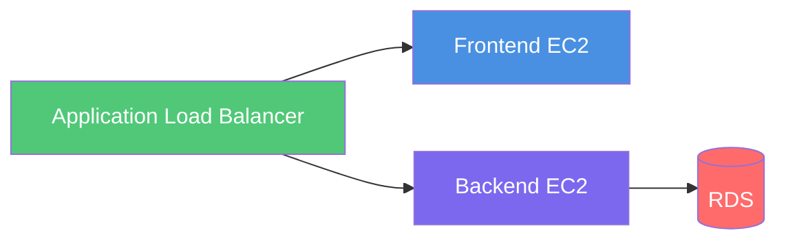
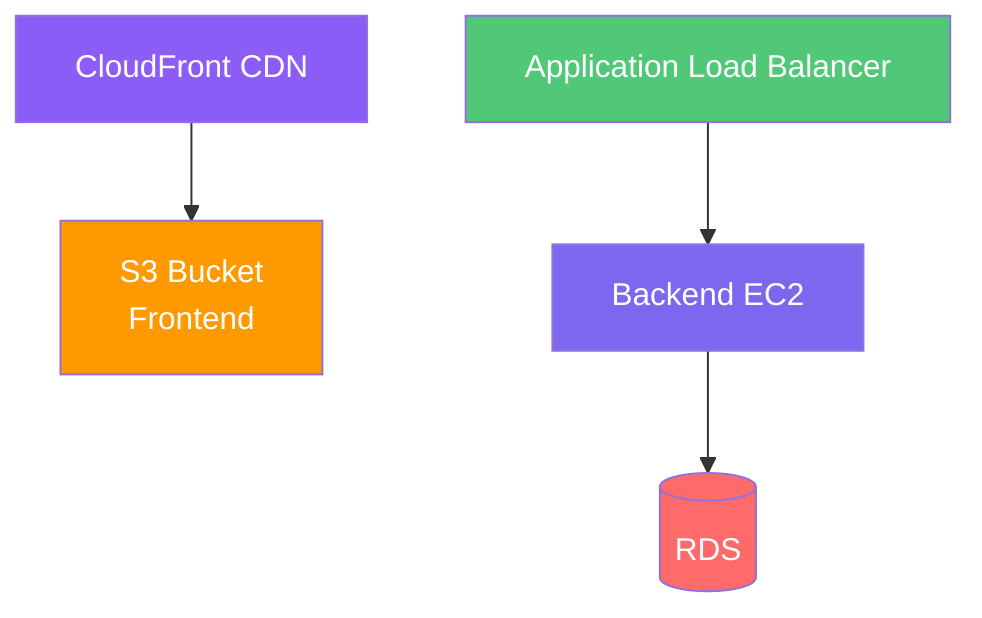
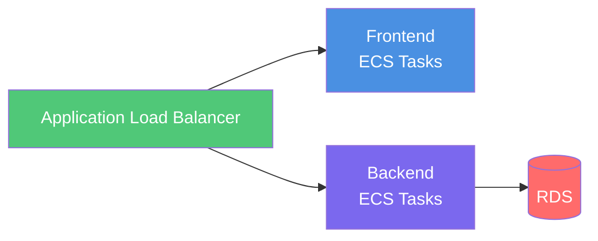
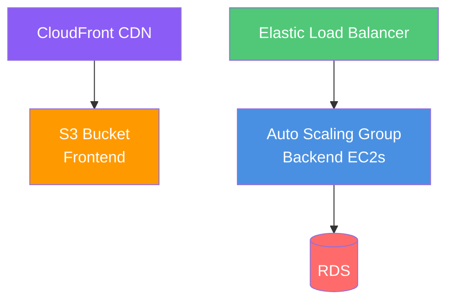
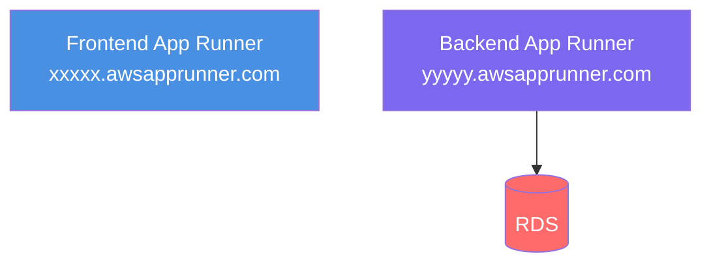
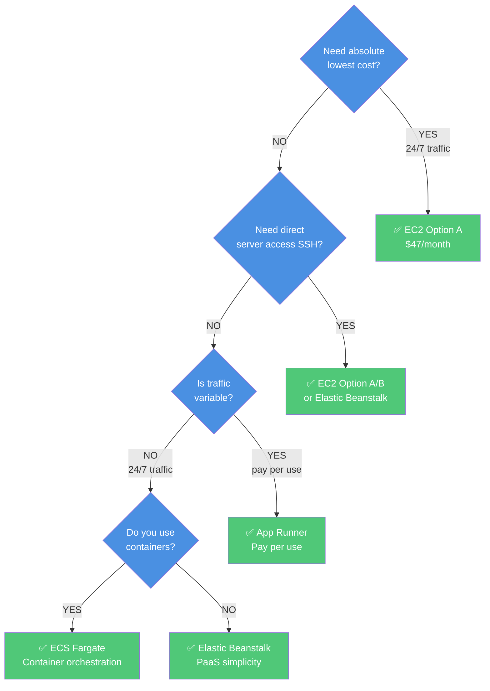

# AWS Deployment Options - Complete Comparison

This document provides a comprehensive comparison of all deployment options to help you choose the best fit for your application.

## Quick Decision Matrix

| Priority | Recommended Option | Why |
|----------|-------------------|-----|
| 💰 **Lowest Cost (24/7)** | EC2 (Option A) | $47/month - Traditional VMs |
| 🚀 **Fastest Deployment** | App Runner | 2-4 minutes |
| 📈 **Best Scalability** | ECS Fargate | Container orchestration |
| 🎯 **Easiest Management** | App Runner | Fully serverless |
| ⚙️ **Most Control** | EC2 (Option A) | Direct server access |
| 🌍 **Global Performance** | EC2 (Option B - S3+CloudFront) | CDN for frontend |
| 🔄 **Best for Microservices** | ECS Fargate | Container native |
| 📊 **Variable Traffic** | App Runner | Pay per use |
| 🏢 **Traditional Apps** | Elastic Beanstalk | PaaS simplicity |
| 🆓 **Lowest Cost (Dev)** | App Runner | ~$16/month |

## Detailed Comparison

### 1. EC2 Options

#### Option A: EC2 for Both (Traditional)

**Pros**:
- ✅ Lowest cost for 24/7: $47/month
- ✅ Full server control (SSH access)
- ✅ Simple architecture
- ✅ Direct debugging
- ✅ No container knowledge needed

**Cons**:
- ❌ Manual scaling
- ❌ Manual OS updates
- ❌ Server management required
- ❌ No auto-healing
- ❌ Longer deployment time

**Best For**: Cost-sensitive, always-on workloads with predictable traffic

---

#### Option B: EC2 Backend + S3/CloudFront Frontend

**Pros**:
- ✅ Lower cost: $41.50/month (13% savings)
- ✅ Global frontend performance
- ✅ Auto-scaling frontend (S3/CloudFront)
- ✅ Free HTTPS for frontend
- ✅ Better for SPA applications

**Cons**:
- ❌ More complex setup
- ❌ CloudFront cache invalidation delays
- ❌ Manual backend scaling
- ❌ Split architecture complexity

**Best For**: Applications with global users, static SPA frontend

---

### 2. ECS Fargate

**Pros**:
- ✅ No server management (serverless)
- ✅ Container orchestration
- ✅ Auto-scaling
- ✅ Rolling deployments (zero-downtime)
- ✅ Multi-AZ high availability
- ✅ Container health checks

**Cons**:
- ❌ Higher cost: $81/month
- ❌ Container knowledge required
- ❌ More complex than EC2
- ❌ 30-60s task startup time
- ❌ No direct server access

**Best For**: Container workloads, microservices, teams comfortable with Docker

---

### 3. Elastic Beanstalk

**Pros**:
- ✅ Balanced cost: $49/month
- ✅ PaaS simplicity
- ✅ Auto-scaling included
- ✅ Managed platform updates
- ✅ Easy rollback
- ✅ Multiple environments (dev/staging/prod)
- ✅ Integrated monitoring

**Cons**:
- ❌ Less control than EC2
- ❌ AWS platform lock-in
- ❌ Slower deployments (15-20 min)
- ❌ Basic container support

**Best For**: Traditional Java/Python/Node.js apps, teams wanting PaaS

---

### 4. App Runner

**Pros**:
- ✅ Simplest deployment
- ✅ Fastest deployment: 2-4 minutes
- ✅ Auto HTTPS included
- ✅ True serverless (pay per use)
- ✅ Best for low traffic: $16/month
- ✅ Auto-scaling automatic
- ✅ No infrastructure management

**Cons**:
- ❌ Expensive for 24/7: $119/month
- ❌ Cold start latency
- ❌ Less customization
- ❌ No custom load balancer
- ❌ Regional service only

**Best For**: Variable traffic, rapid deployment, teams new to AWS

---

## Cost Comparison

### Monthly Costs (Production - 24/7)

| Option | EC2 (A) | EC2 (B) | ECS | Elastic Beanstalk | App Runner |
|--------|---------|---------|-----|-------------------|------------|
| **Compute** | $15 | $7.50 | $48 | $15 | $112 |
| **Load Balancer** | $16 | $16 | $16 | $16 | - |
| **Storage/CDN** | - | $1.50 | - | $1.50 | - |
| **VPC Connector** | - | - | - | - | $7 |
| **Common (RDS)** | $15.50 | $15.50 | $15.50 | $15.50 | $15.50 |
| **Other** | $0.50 | $0.50 | $1.50 | $1 | - |
| **Total** | **$47** | **$41.50** | **$81** | **$49** | **$134.50** |

### Monthly Costs (Development - 8% uptime)

| Option | EC2 | ECS | Elastic Beanstalk | App Runner |
|--------|-----|-----|-------------------|------------|
| **Total** | $47* | $81* | $49* | **$31.50** |

*EC2/ECS/EB don't scale to zero - always pay full cost

---

## Feature Comparison Matrix

| Feature | EC2 (A) | EC2 (B) | ECS | Elastic Beanstalk | App Runner |
|---------|---------|---------|-----|-------------------|------------|
| **Management Level** | High | High | Low | Medium | None |
| **Setup Time** | 10 min | 15 min | 12 min | 20 min | 5 min |
| **Deployment Time** | 5-10 min | 5-10 min | 8-12 min | 15-20 min | 2-4 min |
| **Auto-Scaling** | ❌ Manual | ❌ Manual | ✅ Auto | ✅ Auto | ✅ Auto |
| **Zero-Downtime Deploy** | ❌ | ❌ | ✅ | ✅ | ✅ |
| **SSH Access** | ✅ Both | ✅ Backend | ❌ | ✅ | ❌ |
| **Auto HTTPS** | ❌ | ⚠️ Frontend | ❌ | ⚠️ Frontend | ✅ Both |
| **Global CDN** | ❌ | ✅ Frontend | ❌ | ✅ Frontend | ❌ |
| **Container Required** | ❌ | ❌ | ✅ | ❌ | ✅ |
| **Platform Updates** | Manual | Manual | Manual | Auto | Auto |
| **Multi-AZ HA** | ❌ | ❌ | ✅ | ✅ | ✅ |
| **Health Checks** | Manual | Manual | ✅ | ✅ | ✅ |
| **Logs Integration** | Manual | Manual | ✅ | ✅ | ✅ |
| **Pay Per Use** | ❌ | ❌ | ❌ | ❌ | ✅ |

---

## Scaling Comparison

### Traffic Pattern: 100 → 1000 requests/min

| Option | How it Scales | Time to Scale | Manual Effort |
|--------|--------------|---------------|---------------|
| **EC2 (A)** | Manual - Update ASG or add instances | 3-5 min | High - requires monitoring |
| **EC2 (B)** | Frontend: Auto (S3/CloudFront) Backend: Manual | Frontend: Instant Backend: 3-5 min | Medium |
| **ECS** | Auto - New tasks launched | 30-60 sec | Low - configure once |
| **Elastic Beanstalk** | Auto - New instances added | 2-3 min | Low - configure once |
| **App Runner** | Auto - New instances | 30-60 sec | None - automatic |

---

## Use Case Recommendations

### Startup / MVP
**Recommendation**: **App Runner**
- Fastest to deploy
- Lowest initial cost
- No infrastructure management
- Easy to iterate

### Small Business (Predictable Traffic)
**Recommendation**: **EC2 Option B** or **Elastic Beanstalk**
- Lower fixed cost
- Sufficient for predictable traffic
- S3+CloudFront for global reach

### Growing Company (Variable Traffic)
**Recommendation**: **ECS** or **Elastic Beanstalk**
- Auto-scaling for growth
- Professional infrastructure
- Easy to manage

### Enterprise (High Traffic)
**Recommendation**: **ECS** or **EC2 (with ASG)**
- Cost-effective at scale
- Full control
- High availability

### Side Project / Hobby
**Recommendation**: **App Runner**
- Pay only when used
- Minimal management
- Can scale if needed

---

## Decision Tree

---

## Skill Level Requirements

| Option | Required Skills | Learning Curve |
|--------|----------------|----------------|
| **EC2 (A)** | Linux, networking, Docker basics | Medium |
| **EC2 (B)** | Linux, networking, Docker, S3, CloudFront | Medium-High |
| **ECS** | Containers, networking, AWS services | High |
| **Elastic Beanstalk** | Application packaging, basic AWS | Low-Medium |
| **App Runner** | Containers (basic), minimal AWS | Low |

---

## Migration Complexity

**From → To**:

| From | To EC2 | To ECS | To Elastic Beanstalk | To App Runner |
|------|--------|--------|---------------------|---------------|
| **EC2** | Easy | Medium | Easy | Medium |
| **ECS** | Medium | - | Hard | Easy |
| **Elastic Beanstalk** | Easy | Medium | - | Medium |
| **App Runner** | Medium | Easy | Medium | - |

---

## Summary Recommendations

### Choose EC2 Option A if:
- 💰 Cost is the absolute priority
- 🔧 You need full server control
- 📊 Traffic is predictable and always-on
- 🛠️ Team is comfortable with server management

### Choose EC2 Option B if:
- 🌍 Global users need fast frontend
- 💰 Cost optimization + performance
- ⚛️ Frontend is a static SPA
- 🔐 Want free HTTPS for frontend

### Choose ECS if:
- 🐳 Application is containerized
- 📈 Need auto-scaling
- 🔄 Want zero-downtime deployments
- 🏗️ Planning microservices architecture

### Choose Elastic Beanstalk if:
- 🎯 Want PaaS simplicity
- ☕ Running Java/Python/Node.js
- 🔄 Need multiple environments easily
- 💼 Team wants managed infrastructure

### Choose App Runner if:
- 🚀 Simplicity is key
- 📊 Traffic is variable
- ⏰ Fast deployment critical
- 💵 Optimizing dev/test costs
- 🆕 Team is new to AWS

---

## Next Steps

1. Review the detailed README for your chosen option:
   - [EC2 Options](1-ec2/README.md)
   - [ECS](2-ecs/README.md)
   - [Elastic Beanstalk](3-elastic-beanstalk/README.md)
   - [App Runner](4-app-runner/README.md)

2. Decide between Manual or Terraform deployment

3. Deploy common infrastructure first (all options require this)

4. Follow the specific deployment guide

## Support

For detailed deployment steps, see each option's terraform/README.md file:
- [1-ec2/option-a-ec2/terraform/README.md](1-ec2/option-a-ec2/terraform/README.md)
- [1-ec2/option-b-s3-cloudfront/terraform/README.md](1-ec2/option-b-s3-cloudfront/terraform/README.md)
- [2-ecs/terraform/README.md](2-ecs/terraform/README.md)
- [3-elastic-beanstalk/terraform/README.md](3-elastic-beanstalk/terraform/README.md)
- [4-app-runner/terraform/README.md](4-app-runner/terraform/README.md)
